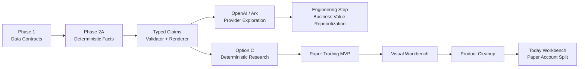
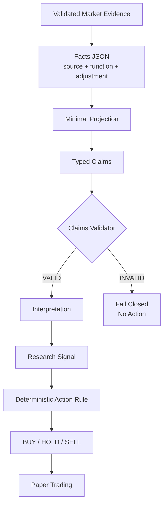
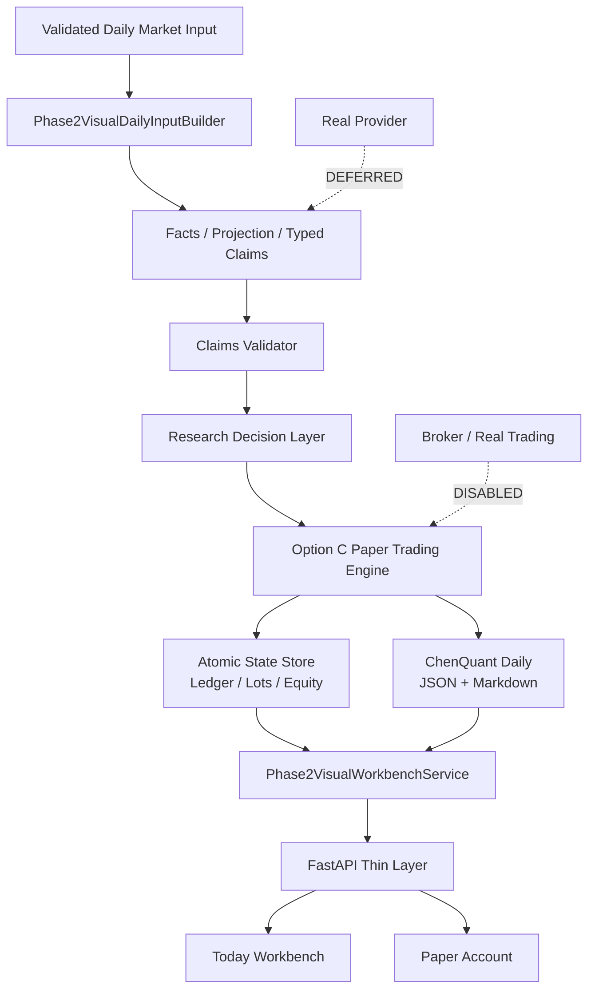
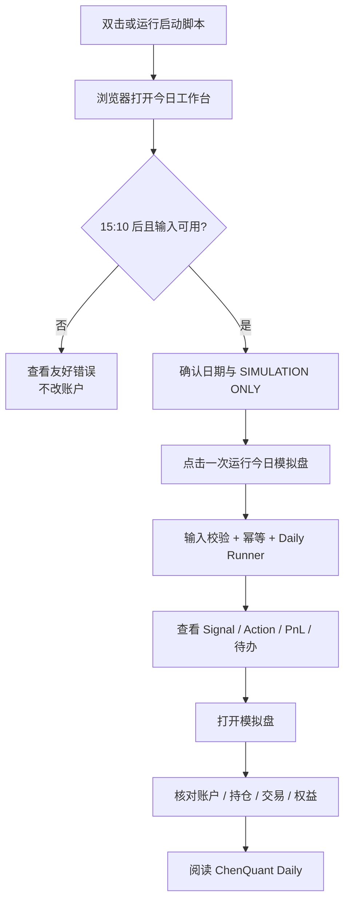

# TickFlow Stock Panel 项目结项与复盘（单文件交付版）

> Final status: `TICKFLOW_PROJECT_CLOSEOUT_READY_FOR_REVIEW`
> Consolidation source commit: `13ab7c36a93d6fadc3544a7f2f5a82048adcd66c`
> Product: `Paper Trading=ACTIVE` / `Real Provider=DEFERRED` / `Real Trading=DISABLED` / `SIMULATION ONLY`
> Evidence scope: 55 indexed artifacts, 22 timeline milestones, 4 architecture diagrams.

## 单文件交付口径

本文件是对外阅读与交接的唯一主版本，依次包含执行摘要、完整项目报告、时间线与决策、技术附录、独立复审、完整证据目录和一页纸最终结论。

`reports/project_closeout/` 下的分拆 Markdown 与 JSON 继续保留，只作为审计附件和机器校验来源；若内容解释出现冲突，以当前 Git、不可变 evidence 和本单文件中的收口口径为准。

---

---

# 第一部分：执行摘要

> 结项状态：`TICKFLOW_PROJECT_CLOSEOUT_READY_FOR_REVIEW`
> 当前产品：`Paper Trading=ACTIVE`、`Real Provider=DEFERRED`、`Real Trading=DISABLED`、`SIMULATION ONLY`
> 当前范围：单票 `000403.SZ` 派林生物，本地浏览器日用，不含券商、实盘、三票批次、云端自动发布。

## TickFlow 是什么

TickFlow 当前是一套面向 A 股单票日线研究的确定性工作流：把已验证行情冻结为 Facts，经 Projection、Typed Claims、Research Decision 和 Paper Trading 规则层，形成可追溯的模拟账户、PnL、ChenQuant Daily 与浏览器工作台。它不是 AI 荐股器，也不是自动交易系统。

**FACT**：当前首页为 `/paper-trading`“今日工作台”，账户页为 `/paper-account`“模拟盘”；二者读取同一份 Option C 持久状态，只有今日工作台具有受控的 Daily Run 入口。页面固定显示 `SIMULATION ONLY / REAL TRADING DISABLED`。

Evidence: `TICKFLOW_VISUAL_WORKBENCH_V1_RUNBOOK.md`、`TICKFLOW_WORKBENCH_ACCOUNT_UX_SPLIT_RELEASED.md`、`frontend/src/router.tsx`。
Commit: `f1587ab62950583205d28652fe7e952f7dd28434`

## 为什么立项

原始问题不是“让大模型替人选股”，而是把零散的 A 股研究步骤变成一个每天可重复、可验证、可回放的闭环：数据必须有来源，结论必须经过结构化校验，模拟动作必须满足 A 股规则，结果必须能持久保存并形成盘后素材。

**DECISION**：先用三票、五个实际交易日验证数据合同，再建立 Facts 与 Claims，避免把不稳定输入直接交给 AI 或模拟账本。

**RETROSPECTIVE**：这一步是项目最重要的正确顺序。它让后续 Provider 失败时，数据、规则和账本仍可独立交付。

Evidence: `reports/tickflow_phase1_observation_final.md`、`reports/tickflow_phase2a_facts_eval.md`。

## 架构如何变化

1. **Data contract**：三票五日观察，验证日线、分钟线、复权、30m 聚合、429 与敏感信息边界。
2. **Deterministic Facts**：把行情、指标、来源、计算函数和口径固化为可校验 JSON。
3. **Typed Claims**：用 Strict Schema、Claims Validator 和 Deterministic Renderer 限制自由文本。
4. **Provider exploration**：为 OpenAI/Ark 建立隔离 Relay、不可变 Candidate、Approval Scope、one-shot、ledger、receipt 和 TLS 诊断。
5. **Engineering stop**：真实 Provider 路径没有形成稳定业务输出，工程成本持续上升，Provider 被移出 Critical Path。
6. **Option C**：使用冻结 Facts/Claims 和确定性研究规则，直接进入 T+1 Paper Trading、PnL 和 ChenQuant Daily。
7. **Product delivery**：从 CLI Daily Runner 进入 Visual Workbench，再完成导航清理和“今日工作台/模拟盘”职责拆分。

## 为什么真实 Provider 被 Deferred

真实 Provider 并非简单“调用失败”。工程先后证明了：Strict JSON Schema、精确模型/端点、只读 Secret 注入、单次尝试、不可变审批、出站白名单、失败关闭、持久 ledger 和阶段 receipt 都是可实现的安全控制；同时也留下了 `ATTEMPT_CONSUMED_UNKNOWN`、OpenAI HTTP 401、Ark 连接/响应头等待、TLS/Proxy 差分无法完全归因等负面证据。

**FACT**：历史真实请求没有产出可进入正式 Claims 路由的结果；所有发生网络 dispatch 的 request 对应 Scope 都按一次性合同消费并保留，未自动重试，`can_publish=false`。只完成离线审批但未执行的 Scope/Candidate 则保持未消费或 superseded 状态。

**DECISION**：停止继续扩大 Provider/TLS/Proxy 工程，将真实 Provider 标记为 `DEFERRED`。

**RETROSPECTIVE**：这是 `BUSINESS_VALUE_REPRIORITIZATION`，不是技术投降。Provider 的边界设计仍是资产，但它不应阻塞最小业务闭环。

Evidence: `reports/tickflow_phase2b_single_symbol_canary_eval.md`、`reports/tickflow_phase2b_http401_diagnosis.md`、`reports/tickflow_phase2b_ark_proxy_tls_differential_eval.md`。

## Option C 为什么成为 Critical Path

Option C 把模型从执行关键路径移除：

`Frozen Facts → Projection → Deterministic Reference Fixture → Typed Claims Validator → Research Decision → Paper Trading → PnL → ChenQuant Daily`

它保留了最有价值的工程约束：事实可追溯、Claims 结构化、决策分层、无未来数据、A 股 T+1、下一交易日开盘成交、Decimal 账本、幂等与可回放。它也接受真实冻结样本计算出的 `MIXED_OBSERVATION → HOLD`，没有为了演示交易而改 Fixture 或规则；BUY/SELL 只用明确的 deterministic test fixture 验证。

**FACT**：单票验证中 HOLD 不产生订单或交易，现金和权益保持一致；完整测试生命周期另行验证 BUY、T+1、SELL、费用和 PnL。

Evidence: `reports/tickflow_phase2b_option_c_paper_trading_eval.md`、`reports/tickflow_phase2b_single_symbol_paper_trading_validation.md`、`reports/phase2_option_c_mvp/release_verification.json`。

## 最终产品能做什么

- 一键启动本地服务并打开浏览器。
- 在“今日工作台”查看交易日状态、Research Signal、Paper Action、Claims 状态、今日持仓、PnL、待办与 ChenQuant Daily。
- 在安全门禁通过时只运行一次今日模拟盘。
- 在“模拟盘”查看总资产、现金、持仓、可卖数量、成本、已实现/未实现 PnL、最大回撤、决策、交易和权益曲线。
- 刷新或重启后读取原子持久化状态，不由前端重新计算账本。
- 固定执行 `A 股 T+1`、`NEXT_TRADING_DAY_OPEN`、100 股整数手、Decimal 费用和幂等控制。

## 当前不能做什么

- 不调用真实 OpenAI/Ark；AI 输出不是 MVP 必需条件。
- 不连接券商，不发送真实订单，不提供真实交易路径。
- 不支持三票正式批次、全市场扫描、云端部署或自动发布。
- 单票持仓跨除权口径变化时 fail closed，要求人工核验。
- volume/amount 单位及 30m 首桶等供应商口径仍保留待确认状态。

## 三个最重要成果

1. **确定性研究资产**：Facts、Projection、Typed Claims、Validator、Research Decision 的可追溯链。
2. **可信模拟账本**：T+1、下一交易日开盘、Decimal、费用、PnL、回撤、幂等、恢复和 Replay。
3. **可日用产品**：CLI 引擎被薄 API 和浏览器工作台包装，研究页与账户页职责清晰，状态持久化。

## 三个最重要教训

1. **Provider 不是产品价值本身**：真实模型接通若不能稳定形成可验证业务输出，就不应占据 Critical Path。
2. **AI Agent 会同时放大速度与复杂度**：它能快速建立审批、ledger、receipt、TLS 隔离，也能让局部工程问题不断产生新合同和新 Scope。
3. **HOLD 是有效结果**：研究系统的价值在于忠实执行数据与规则，不在于每天制造动作。

## 项目成本与可信口径

可由 Git 和工件证明的证据跨度为 2026-07-27 至 2026-08-25，含首尾 30 个日历日期、历时 29 天；Phase 2 主链从 2026-07-31 至 2026-08-25，含首尾 26 个日期、历时 25 天。该跨度内有 18 个发生相关 Git 提交的活跃日期。日历跨度和活跃提交日都不等于实际人时。

测试数字来自各阶段正式报告，测试集合存在重叠，不能相加为项目总测试量。仓库没有可信的项目级 Codex token 总账，也没有完整 Agent wall-clock 汇总，因此本报告不伪造总 token 或总工时；若未来补充单任务统计，必须标记 `PARTIAL OBSERVED AGENT USAGE`。

## 下一阶段最值得投入什么

先进入真实日用，积累单票研究决策、HOLD/交易、PnL 和人工复核记录；再根据真实使用中的高频摩擦决定是否扩展第二只股票、企业行动处理和输入自动化。Provider 只在明确的、可量化的增益假设下重新进入，例如“在不改变动作规则的前提下提高解释质量”，而不是再次承担关键路径。

推荐路径：

`Data → Deterministic Research → Paper Trading → Visual Workbench → Real Usage → Optional Provider`

## 当前日用入口

```bash
cd "/Users/macbookpro/Documents/TradingView 量化/tickflow-phase2-ai-review"
./scripts/start_tickflow_visual.sh
```

浏览器：`http://127.0.0.1:3018/paper-trading`

日用纪律：收盘后检查日期与安全标识，只点击一次“运行今日模拟盘”；先看今日工作台，再到模拟盘检查账户与历史。任何输入、企业行动或状态错误都应保持 fail closed，不手工改写账本文件。

---

# 第二部分：完整项目报告

> 报告基线：Git Head `f1587ab62950583205d28652fe7e952f7dd28434`
> 证据日期：截至 2026-08-25（Asia/Shanghai）
> 产品状态：`Paper Trading=ACTIVE`、`Real Provider=DEFERRED`、`Real Trading=DISABLED`、`SIMULATION ONLY`

本报告把陈述分为三类：

- **FACT**：Git、报告、JSON、Runbook、测试或当前代码可以直接证明。
- **DECISION**：当时为推进项目做出的工程或产品选择。
- **RETROSPECTIVE**：项目完成后形成的解释，不冒充当时已经知道的事实。

## 1. Executive Context

TickFlow 最终不是“AI 自动选股平台”，而是一套单票 A 股日线研究与模拟盘工作台。它将已验证数据转成可追溯 Facts，通过结构化 Claims 和确定性规则生成 Research Signal 与 Paper Action，再以 A 股 T+1 和下一交易日开盘成交规则维护模拟账本、PnL、回撤与 ChenQuant Daily，最后通过浏览器提供日用入口。

**FACT**：当前正式范围仅包含 `000403.SZ` 派林生物；真实 Provider、券商、实盘、三票批次、云部署和自动发布均未发布。

**RETROSPECTIVE**：项目的最终价值并不来自某次模型回答，而来自一条“输入可证、决策可解释、动作可回放、状态可恢复”的工作流。

Evidence: `TICKFLOW_PAPER_TRADING_MVP_RELEASED.md`、`TICKFLOW_VISUAL_WORKBENCH_V1_RELEASED.md`。

## 2. Project Genesis

项目最初要解决三个问题：

1. A 股研究输入分散，数据口径与日期需要反复人工确认。
2. 指标和观点容易停留在描述层，缺少可验证的规则和账本。
3. 盘后研究结果难以形成稳定的日用素材和持续状态。

**DECISION**：不接券商、不做自动下单，先旁路验证数据、研究、模拟和复盘闭环。

**FACT**：2026-07-27 至 07-31 的 Phase 1.2 留下五个实际交易日的三票合同证据；2026-07-31 的合并基线后进入 Phase 2。

Evidence: `reports/tickflow_phase1_observation_final.md`、`reports/phase1_observation/observation_index.json`。
Commit: `3af4185b0342c9f274c2ba7b8cd18e6c2c8745dd`

## 3. Initial Product Thesis

初始产品假设可以概括为：

`可信市场数据 + 结构化 AI 解释 + 可发布 Markdown = 个股复盘素材源`

这个假设包含一个隐含风险：把“真实 Provider 稳定返回严格结构化内容”当成了接近确定的基础能力。项目随后花费大量工程来约束这个不确定环节。

**RETROSPECTIVE**：更稳妥的初始假设应是：数据、指标、决策和账本必须在没有 Provider 的情况下也成立；模型只补充解释，不拥有事实或动作。

## 4. Architecture Evolution



**FACT**：Provider 分支没有被删除；它被保留为历史隔离与安全资产，但已经不在当前 Critical Path。

**DECISION**：Option C 复用 Facts、Claims Validator 与 Renderer，不重新设计第二套研究架构。

## 5. Provider / Structured Output Exploration

选择真实 Provider 有合理背景：模型若能按 Strict JSON Schema 返回 Typed Claims，就可能在不自由发挥数字的前提下，提供可读解释并衔接 Markdown 复盘。

因此工程强调：

- `strict JSON Schema`：禁止自由文本、未知字段和交易 Claim。
- `immutable candidate`：把模型、端点、Prompt、Schema、Facts/Projection 哈希和镜像身份绑定到一次审批。
- `approval scope`：每个真实尝试只在独立 Scope 内生效，历史 Scope 不可复用。
- `one-shot`：`maximum_provider_attempts=1`、`retry_count=0`，避免不透明重试。
- `ledger`：网络 dispatch 一旦开始，attempt 永久消费；无法证明是否发送时标记 unknown。
- `receipt`：记录 DNS/TCP/TLS/request/headers/body 等阶段，提升可诊断性。
- `isolation`：Secret 临时只读注入、出站白名单、Proxy/Relay 分离、失败关闭。

**FACT**：这些机制通过了大量 Mock、专项测试和离线审批门禁；它们证明了安全治理能力，不等于证明真实 Provider 业务链已经可用。

Evidence: `reports/tickflow_phase2b_provider_relay_eval.md`、`reports/tickflow_phase2b_canary_runtime_contract_eval.md`、`reports/tickflow_phase2b_canary_observability_eval.md`。

## 6. Ark / TLS / Proxy Engineering

OpenAI 路径曾留下两类关键负面结果：一次 `ATTEMPT_CONSUMED_UNKNOWN`，以及一次精确 HTTP 401。Ark 路径进一步经历 exact model 的 Structured Output 能力门、严格 `json_schema`、60/75/90 到 180/195/210 的 timeout 合同、build provenance、receipt transport、TLS probe 与 Proxy/TLS 差分诊断。

**FACT**：Ark 实际 Canary `d57b276fe9014d35bdae5a92950ca17b` 在 Provider 连接阶段被阻断，未完成 TLS、未写请求体，Scope 被消费；另一个历史 Ark request `2f17745f...` 固定为 `FAILED_AFTER_DISPATCH / CONSUMED / WAITING_FOR_PROVIDER_RESPONSE_HEADERS`。后续本地差分工具仍不能证明真实 Proxy 路径的唯一根因。

**DECISION**：不删除失败证据、不复用 consumed Scope、不自动重试，也不通过改模型、改 Prompt 或降级 free text 来制造成功。

**RETROSPECTIVE**：这段工程形成了高质量的安全与可观测性资产，但业务验证增量越来越小。每一次不可归因的失败都会产生新 Candidate、Scope、hash 集合、mock 和审批，形成明显的治理放大效应。

Evidence: `reports/tickflow_phase2b_single_symbol_canary_eval.md`、`reports/tickflow_phase2b_http401_diagnosis.md`、`reports/phase2_provider_ark/live_canary/d57b276fe9014d35bdae5a92950ca17b-closeout.md`、`reports/tickflow_phase2b_ark_proxy_tls_differential_eval.md`。

## 7. Engineering Cost Escalation

成本升级主要不是代码行数，而是“证明一次请求安全且不可重复”所需的合同数量：Provider config、Proxy image、Relay image、runtime contract、approval candidate、approval scope、ledger namespace、stage receipts、cleanup proof、history baseline、build provenance、TLS probe 与 independent review。

**FACT**：Git 时间线显示 2026-08-02 至 08-16 连续出现 Provider/Canary/Ark/TLS/Approval 相关实现、修复和验证提交。仅这些里程碑就跨越约两周，而真正业务产物仍未获得有效 Claims。

**FACT**：仓库没有完整项目级 Codex token 总账和 wall-clock 总账。本报告不会拼接聊天中的单次运行数字，也不会虚构总成本。任何未来可验证的单任务 token 统计都必须标记 `PARTIAL OBSERVED AGENT USAGE`。

**RETROSPECTIVE**：AI Coding Agent 让复杂治理工件可以快速实现，也让“再补一个门禁就能成功”的路径更容易持续。速度并不能替代停止标准。

## 8. Engineering Stop Decision

`ENGINEERING_STOP_DECISION` 的含义不是“Provider 技术做不出来”，而是：

`BUSINESS_VALUE_REPRIORITIZATION`

当 Provider 工程的边际投入明显高于对用户日用价值的边际贡献时，项目选择冻结 Legacy Provider path，并把 Facts、Claims、规则和账本作为继续交付的基础。

**DECISION**：不再把 Provider 可用性作为 Paper Trading 和 Visual Workbench 的前置条件。

**RETROSPECTIVE**：这是改变项目结果的关键决策。如果继续围绕 Provider 增加 Scope 与 Probe，项目可能继续“更可证明地失败”，但仍没有每天可用的产品。

Evidence: `reports/tickflow_phase2b_option_c_paper_trading_eval.md` 中 `Option A=EXHAUSTED / Option C=ACTIVE / Legacy Provider path=FROZEN`。

## 9. Transition to Option C

Option C 没有推翻前期成果，而是重新排序：

1. 冻结且验证过的 Facts 继续作为事实源。
2. Projection 继续限制模型/规则可见的数据范围。
3. Typed Claims Validator 继续拒绝未知 Claim、错误 pointer、raw/qfq 混用和交易字段。
4. Research Decision Layer 将 Claims 映射为 `INTERPRETATION → SIGNAL`。
5. 确定性 Rule Engine 才能生成 `ACTION`。
6. Paper Trading 只消费受控 Action 与确定性 Market Fixture。

**FACT**：真实派林生物冻结 Fixture 重新计算得到 `MIXED_TECHNICAL_STRUCTURE → MIXED_OBSERVATION → HOLD`。系统接受 HOLD，没有修改 Fixture 或 Rule 来制造 BUY/SELL。

**RETROSPECTIVE**：Option C 的核心不是“去 AI”，而是把非确定性解释从交易与账本关键路径中隔离。

## 10. Deterministic Research Architecture



**FACT**：Facts 为每个数字记录来源文件、计算函数、价格口径和时间范围，并校验源 SHA、NaN/Infinity、raw/qfq 混用与敏感字段。

**FACT**：Typed Claims 不允许直接生成交易动作。无效 Claims 的结果是 no action，而不是自动删掉非法 Claim 后继续。

Evidence: `reports/tickflow_phase2a_facts_eval.md`、`reports/tickflow_phase2b_typed_claims_eval.md`、`backend/app/services/phase2_research_decision.py`。

## 11. Paper Trading Engine

Paper Trading 的可信度来自明确的市场与账本合同：

- **A-share T+1**：当日买入 lot 的 `sellable_from_trade_date` 不早于下一可交易日。
- **NEXT_TRADING_DAY_OPEN**：决策完成后只在下一可用交易日的 09:30 open 成交。
- **No fallback**：缺少下一日开盘时返回 `NO_EXECUTION_PRICE_AVAILABLE`，不回退 T 日 close，不猜价。
- **Lot size**：BUY 数量必须为 100 股整数手。
- **Decimal accounting**：现金、费用、成本、PnL 和权益不使用浮点近似。
- **Fees**：佣金、最低佣金和卖出费用由 `PaperTradingConfig` 固化。
- **Idempotency**：独立 `order_id` 与绑定 symbol/date/signal/action/fixture/config 的 idempotency key。
- **Position lots**：记录取得日期、数量和可卖日期，支持 partial sell 与 full exit。
- **PnL**：已实现、未实现、总权益和最大回撤由账本确定性计算。
- **Recovery**：每日状态以 staging、fsync、atomic rename、directory fsync 发布，可从完整 day snapshot 恢复。

**FACT**：MVP 的 deterministic lifecycle 验证了 2026-08-03 BUY pending、08-04 以 10.50 买入 100 股、08-05 SELL pending、08-06 以 11.00 卖出，最终已实现 PnL 39.45 元，最大回撤 25.55 元。

Evidence: `reports/phase2_option_c_mvp/release_verification.json`、`backend/app/services/phase2_paper_trading.py`、`backend/app/services/phase2_option_c_state.py`。

## 12. ChenQuant Daily

ChenQuant Daily 是账本与研究结果的确定性展示层，同时输出 JSON 和 Markdown。它包含决策、动作、账户、持仓、PnL、回撤、安全标识和人工待办，不从自由文本反向修改账本。

**FACT**：`can_publish=false`、`trading_advice=false` 和 `SIMULATION ONLY` 是固定边界；JSON 与 Markdown 在 Replay x3 中逐字节一致。

**DECISION**：Markdown 先作为本地素材，不自动写入正式 Obsidian Vault 或金融日报。

Evidence: `backend/app/services/phase2_chenquant_daily.py`、`reports/phase2_option_c/replay_validation.json`。

## 13. From CLI to Visual Workbench

Paper Trading MVP 最初通过 CLI Daily Runner 使用。已批准范围内的确定性合同和 Fixture 通过验证，但用户每天需要记住目录、命令、输入状态和输出位置；这不符合“打开就知道今天做什么”的日用预期。

**DECISION**：复用现有 FastAPI/React，只增加薄 API、聚合服务、今日输入准备器和浏览器页面，不重写引擎。

**FACT**：浏览器调用 `/api/paper-trading/dashboard` 读取持久状态，通过 `/api/paper-trading/run` 触发一次受控运行。前端不重算 PnL，也不拥有账本规则。

Evidence: `backend/app/api/paper_trading.py`、`backend/app/services/phase2_visual_workbench.py`、`frontend/src/lib/api.ts`。
Commit: `443858e47c14ab118c486c6adac80f991a1f7c81`

## 14. Product Cleanup

Visual v1 首版仍暴露历史 AI Provider、API Key 和 SaaS 语言，容易让用户误以为当前 Paper Trading 依赖真实 AI。

**DECISION**：隐藏或禁用历史 Provider/API Key 入口，明确展示 `Paper Trading Engine=ACTIVE`、`AI Provider=DEFERRED`、`Real Trading=DISABLED`；将导航收敛为研究工作台语义。

最终桌面导航：

`今日工作台 / 模拟盘 / 个股研究 / 市场 / 监控 / 数据 / 设置`

**FACT**：产品清理没有改变 Option C、Claims Validator、研究规则或行情算法；Provider calls、Secret reads 与 real trades 均为 0。

Evidence: `TICKFLOW_VISUAL_PRODUCT_CLEANUP_RELEASED.md`。
Commit: `ec6c6d1280db3411f642b16ed4cced1129a606b2`

## 15. Today Workbench vs Paper Account UX Split

页面被拆为两个明确问题：

- **今日工作台** `/paper-trading`：回答“今天我要干什么？”展示市场状态、Today Signal、Today Action、今日持仓、今日 PnL、今日待办、Claims 与 ChenQuant Daily，并拥有唯一运行按钮。
- **模拟盘** `/paper-account`：回答“我的账户现在怎么样？”展示总资产、现金、持仓、可卖数量、成本、累计收益、最大回撤、历史交易、历史决策和权益曲线，不触发运行。

**FACT**：两页共享同一 dashboard API 和同一持久状态，不存在第二套账户逻辑。

Evidence: `TICKFLOW_WORKBENCH_ACCOUNT_UX_SPLIT_RELEASED.md`、`frontend/src/pages/PaperTrading.tsx`、`frontend/src/pages/PaperAccount.tsx`。
Commit: `f1587ab62950583205d28652fe7e952f7dd28434`

## 16. Final Product Architecture



安全属性：

- UI 只做展示与受控触发，不计算交易。
- 账本由 Option C 单一实现维护。
- 输入缺失、日期不符、市场未收盘、企业行动不支持、重复运行或状态异常都 fail closed。
- 历史 Provider 不进入运行依赖。

## 17. Current User Workflow



启动命令：

```bash
cd "/Users/macbookpro/Documents/TradingView 量化/tickflow-phase2-ai-review"
./scripts/start_tickflow_visual.sh
```

浏览器入口：`http://127.0.0.1:3018/paper-trading`

**FACT**：运行状态保存在 `backend/data/user_data/phase2_option_c_paper/reference_account/`，已验证输入在同级 `inputs/`；刷新或重启只读取持久状态。

Evidence: `TICKFLOW_VISUAL_WORKBENCH_V1_RUNBOOK.md`。

## 18. Verification & Quality

| Capability | Status | Evidence |
|---|---|---|
| Deterministic Replay | PASSED | `reports/phase2_option_c_mvp/release_verification.json` |
| A 股 T+1 | PASSED | `reports/tickflow_phase2b_option_c_paper_trading_eval.md` |
| Next-day-open | PASSED | 同上 |
| Look-ahead guard | PASSED | 同上 |
| Future leakage guard | PASSED | 同上 |
| Decimal PnL | PASSED | MVP release verification |
| Idempotency | PASSED | Option C eval / state tests |
| State recovery | PASSED | MVP release verification |
| Desktop | PASSED at Visual v1 baseline | `reports/visual_workbench_v1/delivery_verification.json`（验证 Head `443858e`） |
| Mobile | PASSED at Visual v1 baseline | 同上；早于 2026-08-25 Cleanup/UX Split |
| Current Today/Account split | RELEASE MARKER + SOURCE PRESENT | `TICKFLOW_WORKBENCH_ACCOUNT_UX_SPLIT_RELEASED.md`、当前两页与 E2E contracts |
| UI E2E | 28 passed / 2 skipped at Visual v1 baseline | `reports/tickflow_visual_workbench_v1_eval.md`；不宣称为当前 Head 的重跑结果 |
| Provider calls | 0 in released Option C/Visual path | Release markers |
| Real Trading | DISABLED | Release markers / UI safety banner |
| Independent Review | NO P0/P1 findings | Option C、MVP、Visual reports |

详细测试数字与重叠边界见 `04_TICKFLOW_TECHNICAL_APPENDIX.md`。Visual v1 报告记录后端全量 `2907 passed / 58 failed`；58 项为已冻结 Ark/Gold 历史债务，不属于当前 Option C/Visual 回归，但仍必须保留为技术债，不能改写成“全量全绿”。

## 19. What Worked

1. **先验证数据再谈智能**：五日数据合同和冻结快照为后续所有判断提供了共同基线。
2. **结构化边界有效**：Facts、Projection、Typed Claims 和 Validator 会拒绝未通过来源、口径与 schema 合同的数字或 Claims，并阻止交易字段穿透。
3. **失败关闭有效**：Provider 失败没有自动重试，非法 Claims 没有被“修好后继续”，缺失开盘价不回退收盘价。
4. **接受 HOLD**：真实冻结样本未被人为改造成交易，说明系统忠于规则。
5. **薄 UI 成功**：浏览器复用引擎和持久状态，没有形成 UI 版第二账本。

## 20. What Was Over-engineered

Provider 阶段的每项控制单独看都合理，组合后却超过了当前业务验证需要：不可变镜像、完整 source binding、build provenance、Candidate/Scope 反复重批、approval-scoped ledger、receipt transport、TLS probe v2 和差分路径等，逐步把“一次解释性输出验证”变成了一个高保证网络执行平台。

**RETROSPECTIVE**：过度工程不等于代码质量差。问题在于保证等级与业务价值阶段不匹配。一个尚未证明能提升研究质量的 Provider，不应先获得接近高风险生产执行的治理复杂度。

## 21. What We Would Do Differently

`IF_WE_STARTED_AGAIN`：

`Data → Deterministic Research → Paper Trading → Visual Workbench → Real Usage → Optional Provider`

具体变化：

1. 第一周完成数据合同、Facts 与单票研究规则。
2. 第二周完成 T+1 模拟账本、PnL、Replay 和简单日用页。
3. 先连续日用，确认哪些解释真的需要模型。
4. Provider 只做 sidecar：输入固定 Projection，输出只读 Claims，不生成 Action，不阻塞 Daily。
5. 为 Provider 预先设停止条件：两次受控 Canary 不能形成有效 Claims，即冻结，不继续扩基础设施。

## 22. Current Limitations

- 单票 `000403.SZ`，三票正式批次未发布。
- 本地 Mac 浏览器运行，云部署未发布。
- 真实 Provider 延后，历史 UI 已隐藏或标记不使用。
- 券商与真实交易路径不存在。
- 企业行动遇到持仓口径变化时需人工确认。
- 新鲜日用输入依赖当前准备器和可用行情；失败时不会猜测或回填。
- 供应商待确认：`intraday_batch` 权限、30m 首桶是否包含 09:30、volume 单位、amount 单位。
- 自动 Obsidian/金融日报发布仍关闭。
- 旧 Ark/Gold 测试债务 58 项仍冻结；MVP 记录的三项 P2 中，UI/调度相关已有后续进展，但单票与输入自动化限制仍在。

## 23. Roadmap

优先级按真实业务价值排列：

1. **P0 日用观察**：连续使用单票工作台，记录输入失败、人工核验、HOLD 与交易日体验。
2. **P1 第二票扩展决策**：只有单票状态和企业行动处理稳定后，才扩 `600489.SH` 或 `300059.SZ`。
3. **P1 企业行动合同**：把当前人工 fail-closed 场景转成明确、可验证的账本调整策略。
4. **P1 素材导出**：在 `can_publish=false` 和人工审核前提下，旁路导出 Obsidian 素材。
5. **P2 Optional Provider**：仅在明确评价指标、固定成本上限和停止条件下恢复；Provider 仍不得产生 ACTION。

## 24. Final Assessment

TickFlow 已完成从研究工程验证到单票日用候选产品的转化，并进入真实日用观察。现有证据证明指定合同、Fixture、测试生命周期和 UI 路径通过，尚不能替代发布后的连续日用证据。其价值不是覆盖全市场，也不是替代人工投资判断，而是让“事实、解释、信号、模拟动作、账户和日报”处在同一条可验证链上。

项目没有证明真实 AI Provider 能稳定为该链路增值；相反，它证明了在 Provider 不可用时仍应维持业务闭环。当前最合理状态是保持 `Real Provider=DEFERRED`，以日用证据决定下一步，而不是再次从网络与审批基础设施开始。

总体判断：

- 作为单票 A 股日线研究和模拟盘：**可用，进入日用观察**。
- 作为正式交易系统：**不成立，也未发布**。
- 作为 AI 产品工程案例：**价值高**，尤其适合研究“如何把模型移出高风险关键路径”。
- 作为未来产品原型：**应围绕真实使用摩擦迭代，而不是围绕 Provider 能力扩张**。

---

# 第三部分：项目时间线与决策日志

## 口径

- 时间线只采用 Git、release marker、正式报告与 verification JSON。
- `PROJECT_START` 指本次可连续追溯的验证/交付主线起点，不代表上游开源仓库的最初创建日期。
- Commit 选取能代表里程碑的 Head，不等于该阶段只有一个提交。
- `Outcome` 同时保留成功与负面结果，不以最终结论改写历史。

## 里程碑

| Date | Milestone | Problem | Decision | Reason | Outcome | Commit | Evidence |
|---|---|---|---|---|---|---|---|
| 2026-07-27 | `PROJECT_START` / Phase 1.2 | 数据日期、分钟合同与供应商口径需要跨日稳定性证据 | 建立三票五个实际交易日观察，不自动补数据 | 先证明输入，再构建研究层 | 观察工作流启动，Day 1 复用既有正式证据 | `f6df50c` | `reports/phase1_observation/` |
| 2026-07-31 | Phase 1 complete | 单日通过不能证明连续稳定 | 完成 5/5 日观察并冻结审计 | 为后续 Facts 提供可信源 | `PHASE1_OBSERVATION_PASSED` | `3af4185` | `reports/tickflow_phase1_observation_final.md` |
| 2026-07-31 | Phase 2 baseline | 需要从已合并基线独立开发 | 从 Phase 1 合并 Head 建立 Phase 2 | 隔离历史治理与新业务工作 | Phase 2 干净基线 | `690f828` | `reports/phase2_merge_and_baseline.md` |
| 2026-07-31 | Deterministic Facts | 指标数字缺少统一来源和口径 | 建立 Facts schema、source hash、calculation registry | 防止 AI 或人工猜数 | `PHASE2A_FACTS_READY` | `7ba58c3` | `reports/tickflow_phase2a_facts_eval.md` |
| 2026-08-01 | Structured Claims | 自由文本无法可靠进入下游 | 建 Strict Typed Claims、Validator、Renderer | 把解释限制为机器合同 | Claims contract ready | `afa6ca6` / `ab68f68` | `reports/tickflow_phase2b_typed_claims_eval.md` |
| 2026-08-01 | Provider isolation | 真实 Provider 需要 Secret、出站与失败关闭边界 | 设计 isolated relay、allowlist 和 Mock E2E | 让真实调用不污染主进程 | Relay 离线验证通过 | `c761b68` / `cba4fc4` | `reports/tickflow_phase2b_provider_relay_eval.md` |
| 2026-08-02 | `OPENAI_PROVIDER_EXPLORATION` | 需要一次严格、不可重试的真实 Canary | 建 OpenAI Proxy、one-shot、store=false、immutable approval | 控制数据泄漏与重复调用 | 形成安全执行框架，业务结果仍未证明 | `165dc46` 至 `38b90dd` | `reports/tickflow_phase2b_canary_runtime_contract_eval.md` |
| 2026-08-08 | Canary observability | 首次 attempt 结果无法证明网络阶段 | 增加 stage receipts、exit 分类与清理前归档 | 精确区分连接、TLS、写入与响应 | 可观测性增强；历史 unknown 被保留 | `928af48` 至 `5c2b476` | `reports/tickflow_phase2b_consumed_unknown_diagnosis.md` |
| 2026-08-10 | Approval-scoped ledger | 全局历史 attempt 会阻塞新批准工件 | ledger namespace 绑定 approval scope | 不篡改历史，同时保证唯一 attempt | 新 scope 可独立证明 attempts=0 | `57ff781` / `f55a0e6` | `reports/tickflow_phase2b_canary_ledger_namespace_eval.md` |
| 2026-08-12 | `ARK_PROVIDER_MIGRATION` | OpenAI Canary 未形成有效 Claims；Ark 旧模型能力不满足 | 迁移 Ark，并用官方能力门排除旧模型 | 验证另一 Provider 的 strict json_schema | 旧模型 preserved/forbidden，新 exact model 进入候选 | `42f9f0e` / `d6a6b54` | `reports/tickflow_phase2b_ark_provider_migration_eval.md` |
| 2026-08-13 | Timeout contract | Ark 请求在响应头前超时 | 仅调整 timeout 为 180/195/210，retry=0 | 做单变量实验，不改 reasoning/Prompt | Mock 通过，真实路径仍需新 Scope | `7127ab4` | `reports/tickflow_phase2b_ark_timeout_contract_eval.md` |
| 2026-08-14 | `TLS_PROXY_ENGINEERING` | DNS/TCP/TLS/request 阶段需可证 | 加 build provenance、receipt transport、TLS probe v2 | 缩小真实路径根因范围 | 形成大量离线证据，但真实 Proxy 根因仍不唯一 | `d4eb447` 至 `23352e5` | `reports/tickflow_phase2b_ark_proxy_tls_differential_eval.md` |
| 2026-08-15 | Isolated Ark scope | 历史 consumed Scope 不能复用 | 创建新 Candidate/Scope，保持历史字节不变 | 遵守 one-shot 与审批边界 | 实际 Canary 仍在连接阶段阻断 | `0bed04b` / `ad458da` | `reports/phase2_provider_ark/live_canary/d57b276fe9014d35bdae5a92950ca17b-closeout.md` |
| 2026-08-16 | `MINIMAL_ARK_PATH` / `OPTION_A_EXHAUSTED` | 完整 Proxy 路径工程成本过高 | 尝试最小 Ark 路径和 read-timeout 单变量实验 | 判断能否低成本恢复 Provider | 未证明可稳定产出 Claims；Option A exhausted | `292cdd3` 至 `2894dd2` | `reports/tickflow_phase2b_option_c_paper_trading_eval.md` |
| 2026-08-16 | `ENGINEERING_STOP_DECISION` | Provider 成本与业务价值失衡 | 将 Provider 冻结并移出 Critical Path | 优先形成可日用业务闭环 | `BUSINESS_VALUE_REPRIORITIZATION` | `bc76c80` / `7e7d94a` | Option C design/eval |
| 2026-08-16 | `TRANSITION_TO_OPTION_C` | 需要不依赖真实 Provider 的研究到动作链 | 复用 Facts/Claims，新增确定性 Decision、T+1 账本与 ChenQuant Daily | 保留安全资产并恢复交付速度 | Option C ready，真实 Fixture 为 HOLD | `68656dd` 至 `3d2fbac` | `reports/tickflow_phase2b_option_c_paper_trading_eval.md` |
| 2026-08-20 | Option C hardening | 初版需补齐 fixture identity、claims source、HOLD 与执行价边界 | 只修 P0/P1，补幂等、状态恢复与 Replay | 防止未来数据、重复交易和账本损坏 | 单票验证通过，无 P0/P1 | `05ae11a` / `1c16efb` | `reports/tickflow_phase2b_single_symbol_paper_trading_validation.md` |
| 2026-08-20 | `PAPER_TRADING_MVP_RELEASE` | CLI 闭环需正式运行合同和 release marker | 固化 Daily Runner、状态目录、Release SHA | 进入可重复离线日用 | `TICKFLOW_PAPER_TRADING_MVP_RELEASED` | `a14e068` / `fbf4c98` | `TICKFLOW_PAPER_TRADING_MVP_RELEASED.md` |
| 2026-08-21 | `VISUAL_WORKBENCH_RELEASE` | CLI 不符合日常浏览器使用预期 | 加薄 API、Dashboard、一键 Run、持久化视图 | 降低每日操作成本 | 本地 Visual v1 发布 | `443858e` / `a34aa05` | `reports/tickflow_visual_workbench_v1_eval.md` |
| 2026-08-25 | `VISUAL_PRODUCT_CLEANUP` | 历史 Provider/API Key/SaaS UI 混淆当前产品 | 收敛导航，隐藏遗留入口，明确能力状态 | 让用户看到真实已发布能力 | 产品壳清理发布 | `ec6c6d1` | `TICKFLOW_VISUAL_PRODUCT_CLEANUP_RELEASED.md` |
| 2026-08-25 | `WORKBENCH_ACCOUNT_UX_SPLIT` | 一个页面同时回答今日任务和账户状态 | 拆成 `/paper-trading` 与 `/paper-account` | 提高日用扫描与职责清晰度 | 两页共享同一状态，仅 Today 可运行 | `f1587ab` | `TICKFLOW_WORKBENCH_ACCOUNT_UX_SPLIT_RELEASED.md` |
| 2026-08-25 | `BEGIN_NORMAL_DAILY_USE` | 工程验证需要转成真实使用反馈 | 冻结扩功能，按 Runbook 单票日用 | 用真实摩擦决定后续投资 | 当前状态：进入日用，仍 Simulation Only | `f1587ab` | `TICKFLOW_VISUAL_WORKBENCH_V1_RUNBOOK.md` |

## 阶段意义

### 从 Phase 1 到 Facts

这不是普通的数据接入。五日观察把“最近一天有数据”升级为“跨交易日合同可复核”，Facts 再把数据转换为可引用、可计算、可哈希的研究输入。这两步是后续所有成功模块的共同基础。

### 从 Claims 到 Provider

Typed Claims 先于真实 Provider 是正确顺序：先定义什么输出可以被系统接受，再决定由谁生成。问题出现在 Provider 执行保障逐渐成为主项目，而不是 Claims 的一个可替换输入源。

### 从 Provider 到 Option C

Option C 没有降低账本标准，只降低了非确定性依赖。它保留 Typed Claims 和 Validator，用确定性 Fixture/Rule 代替真实模型生成，证明业务链本身成立。

### 从 Engine 到 Product

MVP Release 证明指定引擎合同、Fixture 和测试生命周期通过，Visual Workbench 证明已批准的浏览器路径可操作。产品清理与 UX 拆分则解决“页面表达的能力”和“实际发布的能力”不一致的问题；发布后的连续日用稳定性仍需真实使用记录补证。

## KEY_REVERSIBLE_DECISIONS

| Decision | Why reversible | Current state |
|---|---|---|
| Provider Adapter 保留但退出 Critical Path | Facts/Projection/Claims 合同仍兼容可选 Provider | `DEFERRED` |
| 单票范围 | 引擎 schema 可扩，但未批准三票日用 | `000403.SZ only` |
| 本地浏览器部署 | 薄 API/React 可迁移，但云端未发布 | `LOCAL ONLY` |
| Obsidian 自动写入关闭 | ChenQuant Markdown 已存在，可旁路加人工门禁 | `NO FORMAL WRITE` |
| 历史 Settings 页面隐藏 | 路由和代码保留，可在能力真正接通后重做 | `LEGACY HIDDEN` |

## KEY_IRREVERSIBLE_DECISIONS

严格说，软件架构决策大多可逆；真正不可逆的是已发生的外部行为和历史证据：

| Decision / event | Irreversible property | Required preservation |
|---|---|---|
| One-shot dispatch 后消费 attempt | 无法安全证明请求未到 Provider | Scope/ledger 永久不可复用 |
| 历史 HTTP 401 / unknown / Ark blocked | 结果已经发生，不能改写为 success | rejected、receipt、closeout 原字节保留 |
| Paper Trading 已发布日状态 | 日账本形成历史链 | 禁止手工重写 current/day artifacts |
| Release SHA | 对应已验收字节集合 | 新改动必须生成新 Head/Release marker |

## ENGINEERING_STOP_DECISIONS

1. **停止 OpenAI Scope 重试**：unknown 或 401 后均不重复同一 request/scope。
2. **停止 Ark 模型能力猜测**：不支持 Structured Output 的 exact model 被明确排除。
3. **停止继续扩大 TLS/Proxy 工程**：差分诊断不能产生足够业务增量时，不再自动建新 Scope。
4. **停止让 Provider 阻塞产品**：Option A 标记 `EXHAUSTED`，Option C 成为 `ACTIVE`。
5. **停止为演示制造动作**：真实 Fixture 为 HOLD 即接受；BUY/SELL 只在测试 Fixture 中验证。

这些决定的共同原则是：失败证据必须保留，但历史投入不能自动成为继续投入的理由。

---

# 第四部分：技术附录

## 1. 当前运行架构

当前 Visual Workbench 是现有 FastAPI/React 应用上的薄层，核心账本仍由 Option C 单一实现维护。

| Layer | Main artifact | Responsibility |
|---|---|---|
| Startup | `scripts/start_tickflow_visual.sh` | 启动本地后端/前端并打开浏览器 |
| Route | `frontend/src/router.tsx` | 默认进入 `/paper-trading`，提供 `/paper-account` |
| Today UI | `frontend/src/pages/PaperTrading.tsx` | 今日状态、Signal、Action、待办、Daily 与唯一 Run 入口 |
| Account UI | `frontend/src/pages/PaperAccount.tsx` | 账户、持仓、决策、交易、PnL 与权益只读视图 |
| Frontend API | `frontend/src/lib/api.ts` | `paperTradingDashboard` 与 `paperTradingRun` 合同 |
| FastAPI | `backend/app/api/paper_trading.py` | `/api/paper-trading/dashboard`、`/run` 与友好错误映射 |
| Facade | `backend/app/services/phase2_visual_workbench.py` | 聚合状态、输入、Claims、Daily；不拥有交易规则 |
| Input | `backend/app/services/phase2_visual_daily_input.py` | 交易日、收盘、行情日期与企业行动门禁 |
| Research | `backend/app/services/phase2_research_decision.py` | Interpretation、Signal、Action 分层 |
| Ledger | `backend/app/services/phase2_paper_trading.py` | T+1、订单、持仓 lot、费用、PnL、回撤、幂等 |
| Daily | `backend/app/services/phase2_chenquant_daily.py` | 确定性 JSON/Markdown 日报 |
| State | `backend/app/services/phase2_option_c_state.py` | 原子持久化、日快照和恢复 |

### API 合同

```text
GET  /api/paper-trading/dashboard?target_date=YYYY-MM-DD
POST /api/paper-trading/run
body: { "target_date": "YYYY-MM-DD" | null }
```

薄 API 将内部异常映射为稳定错误码，包括：

- `PAPER_INPUT_NOT_READY`
- `PAPER_MARKET_NOT_CLOSED`
- `PAPER_MARKET_SOURCE_UNAVAILABLE`
- `PAPER_CORPORATE_ACTION_REVIEW_REQUIRED`
- `PAPER_RUN_ALREADY_LOCKED`
- `PAPER_RUN_REJECTED`
- `PAPER_STATE_UNAVAILABLE`

这些错误不会触发真实交易，也不会让前端修改账本。

## 2. 目录图

```text
tickflow-phase2-ai-review/
├── backend/
│   ├── app/
│   │   ├── api/paper_trading.py
│   │   ├── schemas/phase2_option_c.py
│   │   └── services/
│   │       ├── phase2_facts.py
│   │       ├── phase2_claims_*.py
│   │       ├── phase2_research_decision.py
│   │       ├── phase2_paper_trading.py
│   │       ├── phase2_option_c_*.py
│   │       ├── phase2_chenquant_daily.py
│   │       ├── phase2_visual_daily_input.py
│   │       └── phase2_visual_workbench.py
│   ├── data/user_data/phase2_option_c_paper/
│   │   ├── inputs/
│   │   └── reference_account/
│   └── tests/test_phase2_*.py
├── frontend/src/
│   ├── pages/PaperTrading.tsx
│   ├── pages/PaperAccount.tsx
│   ├── components/paper-trading/
│   ├── lib/api.ts
│   └── router.tsx
├── reports/
│   ├── phase2_facts/
│   ├── phase2_claims/
│   ├── phase2_provider_canary/
│   ├── phase2_provider_ark/
│   ├── phase2_option_c/
│   ├── phase2_option_c_mvp/
│   ├── visual_workbench_v1/
│   └── project_closeout/
├── scripts/start_tickflow_visual.sh
└── TICKFLOW_VISUAL_WORKBENCH_V1_RUNBOOK.md
```

## 3. 状态文件

Runbook 定义的正式本地状态根：

```text
backend/data/user_data/phase2_option_c_paper/
├── inputs/
│   └── YYYY-MM-DD/
│       ├── raw_daily.json
│       ├── qfq_daily.json
│       ├── facts.json
│       ├── projection.json
│       ├── claims.json
│       ├── claims_validation.json
│       ├── input.json
│       └── manifest.json
└── reference_account/
    ├── current_state.json
    └── days/YYYY-MM-DD/
        ├── account_state.json
        ├── continuous_state.json
        ├── decision_ledger.json
        ├── trade_ledger.json
        ├── position_lots.json
        ├── equity_history.json
        ├── chenquant_daily.json
        ├── chenquant_daily.md
        └── run_receipt.json
```

状态由后端原子发布。前端只读取 API 返回值，不应直接读写这些文件。不能通过编辑 `current_state.json` 或日目录来改变结果。

## 4. Paper Trading Schema 与合同

### PaperTradingConfig

正式合同包含：

```text
initial_cash
commission_rate
minimum_commission
sell_fee_rate
lot_size=100
t_plus_one=true
execution_policy=NEXT_TRADING_DAY_OPEN
```

参考评测中的默认值：初始现金 100000 元、佣金率 0.0003、最低佣金 5 元、卖出费用率 0.0005、滑点 0。

### Idempotency

`order_id` 与 `idempotency_key` 独立。幂等身份显式绑定：

```text
symbol
decision_date
signal_identity
action
fixture_identity
paper_config_identity
```

同一决策或同一订单不能重复改变账户。

### Position Lot

每个 lot 至少记录：

```text
acquired_trade_date
quantity
sellable_from_trade_date
```

可卖数量由 lot 的交易日期计算，不由 UI 推测。

### Trade Record

交易记录包含成交方向、价格、数量、佣金、卖出费用、成本基础、已实现 PnL 和 fixture identity。金额使用 Decimal；BUY 只接受 100 股整数手。

### Execution and valuation

- 决策形成后，只使用下一可用交易日 09:30 open 成交。
- 缺少对应开盘时返回 `NO_EXECUTION_PRICE_AVAILABLE`。
- 估值使用在估值时点已经可用的独立 valuation bar。
- 禁止使用未来行情、未来收盘价或用 T 日 close 替代执行价。

## 5. 决策流水线

```text
Validated Source Evidence
  → Facts (traceable numbers)
  → Minimal Projection
  → Typed Claims
  → Claims Validator
  → INTERPRETATION
  → SIGNAL
  → Deterministic ACTION
  → Paper Trading
  → Ledger / PnL / Drawdown
  → ChenQuant Daily
  → Visual Workbench
```

边界规则：

- Facts 不包含无来源数字。
- Claims 不能包含未知 pointer、未知 predicate、交易建议或口径混用。
- Typed Claims 不能直接生成 ACTION。
- INVALID Claims 结果为 no action。
- 真实参考输入的 `MIXED_OBSERVATION → HOLD` 是正式有效结果。
- BUY/SELL 闭环使用明确标识的 deterministic test fixture，不伪造真实行情。

## 6. 重要服务模块

### Deterministic core

| Module | Notes |
|---|---|
| `phase2_facts.py` | 从冻结行情生成带 provenance 的 Facts |
| `phase2_claims_service.py` | Claims 读取与服务层 |
| `phase2_claims_renderer.py` | 确定性 Markdown 渲染 |
| `phase2_research_decision.py` | Claims 到 Interpretation/Signal/Action 的规则边界 |
| `phase2_paper_trading.py` | 账本、费用、持仓、T+1、PnL、幂等 |
| `phase2_option_c_fixture.py` | 冻结参考 Fixture 与身份校验 |
| `phase2_option_c_daily.py` | 单日 Runner 合同 |
| `phase2_option_c_continuous.py` | 跨日状态演进 |
| `phase2_option_c_state.py` | 持久化与恢复 |
| `phase2_chenquant_daily.py` | JSON/Markdown 输出 |

### Visual delivery

| Module | Notes |
|---|---|
| `phase2_visual_daily_input.py` | 日用输入准备、行情与企业行动门禁 |
| `phase2_visual_workbench.py` | 状态聚合与一次性运行 facade |
| `api/paper_trading.py` | 认证后的薄 HTTP API 与稳定错误码 |
| `PaperTrading.tsx` | 今日工作台，唯一运行入口 |
| `PaperAccount.tsx` | 模拟账户只读视图 |

### Historical Provider path

Provider 模块仍保存在仓库中作为历史资产，包括：

```text
phase2_ai_worker_protocol.py
phase2_provider_relay_protocol.py
phase2_provider_relay_runner.py
phase2_isolation_runtime.py
phase2_openai_canary_runner.py
phase2_canary_orchestrator.py
phase2_canary_runtime_contract.py
phase2_canary_observability.py
phase2_minimal_ark_canary.py
phase2_ark_timeout_contract.py
```

它们当前不是 Visual Workbench 或 Paper Trading 的运行依赖，不应因存在这些文件而判断 `Real Provider=ENABLED`。

## 7. Frontend 路由与产品语义

| Route | Product question | Mutation |
|---|---|---|
| `/paper-trading` | 今天我要干什么？ | 允许受控 `paperTradingRun` |
| `/paper-account` | 模拟账户现在怎么样？ | 无运行 mutation |

当前导航表达的是研究产品，而不是历史 SaaS/Provider 设置：今日工作台、模拟盘、个股研究、市场、监控、数据、设置。历史 API Key UI 被隐藏或标记为 Visual v1 不使用。

## 8. 测试与验证证据

下列数字属于不同阶段、存在重叠，不能相加为“项目测试总数”。

| Stage | Evidence-backed result | Interpretation |
|---|---|---|
| Phase 1.2 | 5/5 valid trading days | 三票数据观察通过 |
| Option C implementation | Paper 36、Option C 68、focused 167 | T+1、执行价、PnL、幂等、Replay |
| Paper Trading MVP | focused 189 passed | 生命周期、恢复、Release SHA |
| Visual Workbench backend focused | 161 passed | 薄 API、输入、状态和错误处理 |
| Visual frontend unit | 104 passed | 页面和展示合同 |
| Visual UI E2E | 28 passed / 2 skipped at Head `443858e` | desktop/mobile、run、persistence；早于当前 Cleanup/UX Split |
| Current UX Split | release marker + source present | 当前两页与 E2E contracts 已提交；未声称重跑旧 E2E 数字 |
| Visual full backend | 2907 passed / 58 failed / 13 warnings | 58 为冻结 Ark/Gold 历史债务，不是全绿 |

Independent Review 在 Option C、MVP 和 Visual 阶段均记录 `NO_P0_P1_FINDINGS`。本次 closeout 另有独立只读复审，见 `review_findings.md`。

## 9. Release Markers

| Marker | Date | Meaning |
|---|---|---|
| `TICKFLOW_PAPER_TRADING_MVP_RELEASED.md` | 2026-08-20 | 单票确定性模拟盘可日用 |
| `TICKFLOW_VISUAL_WORKBENCH_V1_RELEASED.md` | 2026-08-21 | 本地浏览器工作台发布 |
| `TICKFLOW_VISUAL_PRODUCT_CLEANUP_RELEASED.md` | 2026-08-25 | 导航与能力表达收敛 |
| `TICKFLOW_WORKBENCH_ACCOUNT_UX_SPLIT_RELEASED.md` | 2026-08-25 | 今日工作台与账户职责拆分 |

## 10. Replay 与 Release SHA

- Option C 单票 `replay_validation.json` 文件 SHA-256：`30565345a6a35115bf3602fe047fbeb1162eaa85b22c1dcea351d6716a30c6d5`
- Paper Trading MVP Release SHA：`eeb0ed2718198bdf2f78cc969eae81a6f48006c2fe5de3ec496d3bc7c6becae2`

两个 SHA 对应不同验证集合，不能互相替代。前者验证 Option C 单票语义，后者验证 MVP 生命周期和 release bundle。

## 11. 当前技术债

### Current P2

1. 正式运行仍为单票 `000403.SZ`。
2. 持仓跨企业行动/复权口径变化时需要人工核验，未实现自动账本调整。
3. 日用输入准备依赖行情源可用性，失败时只能 fail closed。
4. 供应商 `intraday_batch`、30m 首桶、volume/amount 单位仍待确认。
5. 自动 Obsidian/金融日报发布关闭。
6. 本地模式发布，云端、多用户和调度未发布。
7. 生产前端仍有已有 large-chunk warning。

### Historical frozen debt

Visual Workbench 全量后端报告保留 58 个 Ark/Gold 历史失败。它们不属于当前 Option C 运行关键路径，但不能从质量结论中删除。重新启用 Provider 或 Gold 前必须先重新建立对应基线。

## 12. 项目成本口径

### Calendar duration

- 可证明的证据跨度：2026-07-27 至 2026-08-25，含首尾 30 个日期，elapsed time 为 29 天。
- Phase 2 主链：2026-07-31 至 2026-08-25，含首尾 26 个日期，elapsed time 为 25 天。
- 上述证据跨度内有 18 个发生相关 Git 提交的活跃日期；它不等于连续工作日或实际人时。

### Major rounds

本次时间线列出 22 个里程碑，包含数据观察、Facts、Claims、Provider、Ark/TLS、Option C、MVP、Visual 和产品 UX。里程碑数不是开发迭代总数。

### Commits

当前分支 HEAD 之前包含上游项目历史，不能用仓库总 commit count 代表本项目投入。附录只引用代表性 milestone commits，不虚构“项目总提交数”。

### Agent time and tokens

仓库证据没有完整项目级 Agent 执行时长或 token 账本。因此：

```text
TOTAL_AGENT_DURATION=NOT_AVAILABLE
TOTAL_TOKEN_USAGE=NOT_AVAILABLE
PARTIAL_OBSERVED_AGENT_USAGE=NOT_REPORTED_WITHOUT_REPOSITORY_EVIDENCE
```

这比把若干对话或单任务数字相加更可靠。

## 13. 安全与发布边界

```text
Real Provider         = DEFERRED
AI calls in release   = 0
Real Trading          = DISABLED
Broker API            = NOT CONNECTED
Three-symbol batch    = NOT RELEASED
Cloud deployment      = NOT RELEASED
Automatic publishing  = DISABLED
can_publish           = false
trading_advice        = false
```

本结项任务没有调用 Provider、读取 Secret、执行 TLS Probe、运行真实交易或改写历史 evidence。

## 14. 证据导航

- 管理摘要：`reports/project_closeout/01_EXECUTIVE_SUMMARY.md`
- 主报告：`reports/project_closeout/02_TICKFLOW_PROJECT_CLOSEOUT_REPORT.md`
- 时间线：`reports/project_closeout/03_TICKFLOW_TIMELINE_AND_DECISIONS.md`
- 证据索引：`reports/project_closeout/evidence_index.json`
- 独立复审：`reports/project_closeout/review_findings.md`
- 当前日用手册：`TICKFLOW_VISUAL_WORKBENCH_V1_RUNBOOK.md`

---

# 第五部分：独立复审记录

## Review Scope

独立 reviewer 以当前 Git、release markers、正式 reports、verification JSON、Runbook 和当前代码为权威，对以下初稿做只读复审：

- `01_EXECUTIVE_SUMMARY.md`
- `02_TICKFLOW_PROJECT_CLOSEOUT_REPORT.md`
- `03_TICKFLOW_TIMELINE_AND_DECISIONS.md`
- `04_TICKFLOW_TECHNICAL_APPENDIX.md`
- `evidence_index.json`
- `TICKFLOW_PROJECT_CLOSEOUT.md`

复审重点：历史准确性、后见偏差、无证据结论、遗漏负面结果、成功表述、工程成本、Provider/Option C 语义和当前产品状态。

## Initial Findings

### P0

无。

### P1

| # | Finding | Resolution |
|---:|---|---|
| 1 | 正式日用输入目录误写为 `daily_inputs/` | 已统一改为代码与 Runbook 使用的 `inputs/` |
| 2 | 将 Head `443858e` 的 Visual v1 测试证据当成当前 `f1587ab` 的验收 | 已改为 historical baseline；当前 UX Split 只声明 release marker、source 和 test contracts present，不声称本次重跑 |
| 3 | 入口和附录引用尚不存在的 `review_findings.md` | 本文件已生成，引用现已有效 |
| 4 | “所有相关 Scope 都已消费”过宽 | 已限定为所有发生 network dispatch 的 request 对应 Scope；离线未执行 Scope 保持 available 或 superseded |
| 5 | 证据索引缺少三项直接证据 | 已加入 Ark request `2f17745f...`、已提交的 `PHASE2B_BUSINESS_VALIDATION_OPTIONS.md` 和 MVP `release_replay.json`；未把本地 ignored runtime closeout 冒充 Git 证据 |
| 6 | 2026-07-27 至 08-25 的日历跨度误算为 26/25 | 已修正为含首尾 30 个日期、历时 29 天；Phase 2 为 26/25；另列 18 个活跃提交日 |
| 7 | “引擎正确/用户每天可用”超出合同和 Fixture 证据 | 已改为指定合同、Fixture、测试生命周期和 UI 路径通过，进入连续日用观察 |

### P2

| # | Finding | Resolution |
|---:|---|---|
| 1 | `305653...` 容易被理解成 Replay 组合身份 | 已明确为 `replay_validation.json` 文件 SHA-256 |
| 2 | “阻止数字幻觉”扩大 Validator 能力 | 已改为拒绝未通过来源、口径和 schema 合同的数字或 Claims |
| 3 | 成本可增加可核验代理指标 | 已增加 18 个活跃提交日和 22 个代表性里程碑，并声明不等于人时 |

## Evidence Index Follow-up

初稿 48 条既有索引的路径、SHA、commit、日期和 Head 祖先关系均通过 reviewer 核验。整改后索引为 55 条，并完成：

- 新增 Ark request、业务分叉决策和 MVP lifecycle 三项直接证据；
- 新增当前 Today/Account 展示、单测和 E2E contract 源文件；
- 将 Visual v1 baseline eval、verification 和 release marker 标记为 `historical`；
- 保持 Product Cleanup、UX Split、当前 Runbook 和当前源码为 `current`；
- 55 条索引均有非空 `git_commit`，且对应 commit 位于当前 Head 历史中。

## Final Review Status

```text
P0_OPEN=0
P1_OPEN=0
P2_OPEN=0
UNSUPPORTED_CLAIMS=0
INDEPENDENT_REVIEW=NO_P0_P1_FINDINGS
```

说明：`NO_P0_P1_FINDINGS` 表示本次结项材料经整改后没有剩余 P0/P1 报告问题；不表示历史 Provider 已成功、不表示全量测试全绿，也不表示已获得发布后的连续日用稳定性证据。

---

# 第六部分：证据索引

机器可读索引：`reports/project_closeout/evidence_index.json`

- 证据总数：`55`
- 生成基线 Head：`f1587ab62950583205d28652fe7e952f7dd28434`
- 每项均包含完整路径、类型、日期、Git commit、SHA-256、用途、历史/当前分类和备注。
- 下表使用缩短 SHA 便于阅读，完整 SHA 以 JSON 索引为准。

## 证据类型统计

| Type | Count |
|---|---:|
| `backend_api` | 1 |
| `backend_service` | 6 |
| `data_artifact` | 1 |
| `decision_record` | 1 |
| `evidence_index` | 1 |
| `frontend_api` | 1 |
| `frontend_component` | 1 |
| `frontend_page` | 2 |
| `frontend_route` | 1 |
| `negative_result` | 6 |
| `probe_evidence` | 1 |
| `release_evaluation` | 2 |
| `release_evidence` | 3 |
| `release_marker` | 4 |
| `runbook` | 2 |
| `runtime_evidence` | 1 |
| `schema` | 1 |
| `source_manifest` | 1 |
| `startup_script` | 1 |
| `technical_debt` | 1 |
| `test_suite` | 5 |
| `validation_report` | 8 |
| `verification_json` | 4 |

## 完整证据目录

| # | Type | Status | Path | SHA-256 | Purpose |
|---:|---|---|---|---|---|
| 1 | `validation_report` | `historical` | `reports/tickflow_phase1_observation_final.md` | `8a335eeced7d...` | 五个实际交易日的三票数据观察收口 |
| 2 | `verification_json` | `historical` | `reports/phase1_observation/observation_index.json` | `d3b66743f5a3...` | Phase 1.2 每日观察索引 |
| 3 | `source_manifest` | `historical` | `reports/phase2_source_snapshot/2026-07-31/manifest.json` | `769910e54393...` | Phase 2 冻结行情快照清单 |
| 4 | `validation_report` | `historical` | `reports/tickflow_phase2a_facts_eval.md` | `bdf0e8e104f8...` | 确定性 Facts 层评测 |
| 5 | `verification_json` | `historical` | `reports/phase2_facts/build_manifest.json` | `0128dd61dd63...` | Facts 构建清单 |
| 6 | `data_artifact` | `historical` | `reports/phase2_facts/000403SZ_facts.json` | `adae2b97110d...` | 派林生物确定性 Facts |
| 7 | `validation_report` | `historical` | `reports/tickflow_phase2b_typed_claims_eval.md` | `777be5820e66...` | Typed Claims 合同评测 |
| 8 | `schema` | `historical` | `reports/phase2_claims/schema/phase2_claims.schema.json` | `9a78c1ddb751...` | Typed Claims JSON Schema |
| 9 | `verification_json` | `historical` | `reports/phase2_claims/claims_index.json` | `cc635aac04d3...` | Claims 产物索引 |
| 10 | `validation_report` | `historical` | `reports/tickflow_phase2b_provider_relay_eval.md` | `c85ad6fbb10d...` | Provider Relay 隔离评测 |
| 11 | `runtime_evidence` | `historical` | `reports/phase2_provider_relay/runtime_evidence.json` | `4ae713b5ad46...` | Provider Relay 运行证据 |
| 12 | `negative_result` | `historical` | `reports/tickflow_phase2b_single_symbol_canary_eval.md` | `a1ec5092f1c7...` | OpenAI 单票 Canary 结果 |
| 13 | `negative_result` | `historical` | `reports/tickflow_phase2b_consumed_unknown_diagnosis.md` | `601eb1b07607...` | Canary 可观测性缺口诊断 |
| 14 | `negative_result` | `historical` | `reports/tickflow_phase2b_http401_diagnosis.md` | `755ad9481445...` | OpenAI HTTP 401 诊断 |
| 15 | `validation_report` | `historical` | `reports/tickflow_phase2b_ark_provider_migration_eval.md` | `166820b60768...` | Ark Provider 迁移评测 |
| 16 | `validation_report` | `historical` | `reports/tickflow_phase2b_ark_timeout_contract_eval.md` | `ef104e4c04cd...` | Ark Timeout 合同评测 |
| 17 | `negative_result` | `historical` | `reports/tickflow_phase2b_ark_proxy_tls_differential_eval.md` | `431da9bb4ea6...` | Ark Proxy/TLS 差分诊断 |
| 18 | `negative_result` | `historical` | `reports/phase2_provider_ark/live_canary/d57b276fe9014d35bdae5a92950ca17b-closeout.md` | `087863a4a8c1...` | Ark 实际 Canary 关闭记录 |
| 19 | `probe_evidence` | `historical` | `reports/phase2_provider_ark/tls_connectivity_probe/closeout.md` | `604ea94c0107...` | Ark TLS 连接探测关闭记录 |
| 20 | `validation_report` | `historical` | `reports/tickflow_phase2b_option_c_paper_trading_eval.md` | `f93510835c21...` | Option C Paper Trading 评测 |
| 21 | `validation_report` | `historical` | `reports/tickflow_phase2b_single_symbol_paper_trading_validation.md` | `57a97461c107...` | 单票模拟盘验证 |
| 22 | `verification_json` | `historical` | `reports/phase2_option_c/replay_validation.json` | `30565345a6a3...` | Option C Replay 验证 |
| 23 | `evidence_index` | `historical` | `reports/phase2_option_c/evidence_index.json` | `4f9e1d062cf1...` | Option C 证据索引 |
| 24 | `release_evaluation` | `historical` | `reports/tickflow_paper_trading_mvp_release_eval.md` | `496040046893...` | Paper Trading MVP Release 评测 |
| 25 | `release_evidence` | `historical` | `reports/phase2_option_c_mvp/release_verification.json` | `15ecbe9c5280...` | Paper Trading MVP Release 验证 |
| 26 | `technical_debt` | `historical` | `reports/phase2_option_c_mvp/technical_debt.json` | `75974e599e28...` | MVP P2 技术债 |
| 27 | `release_marker` | `historical` | `TICKFLOW_PAPER_TRADING_MVP_RELEASED.md` | `5fd0fbdfcb0f...` | Paper Trading MVP Release 标记 |
| 28 | `runbook` | `historical` | `TICKFLOW_PAPER_TRADING_MVP_RUNBOOK.md` | `11be46cbd0d2...` | Paper Trading MVP CLI 日用手册 |
| 29 | `release_evaluation` | `historical` | `reports/tickflow_visual_workbench_v1_eval.md` | `ba79ac0f260d...` | Visual Workbench v1 评测 |
| 30 | `release_evidence` | `historical` | `reports/visual_workbench_v1/delivery_verification.json` | `9de19cbeeb0c...` | Visual Workbench v1 交付验证 |
| 31 | `release_marker` | `historical` | `TICKFLOW_VISUAL_WORKBENCH_V1_RELEASED.md` | `91ad78d12c92...` | Visual Workbench v1 Release 标记 |
| 32 | `runbook` | `current` | `TICKFLOW_VISUAL_WORKBENCH_V1_RUNBOOK.md` | `c5c6135812d8...` | 当前正式日用手册 |
| 33 | `release_marker` | `current` | `TICKFLOW_VISUAL_PRODUCT_CLEANUP_RELEASED.md` | `6c63586d4d9e...` | Visual 产品清理 Release |
| 34 | `release_marker` | `current` | `TICKFLOW_WORKBENCH_ACCOUNT_UX_SPLIT_RELEASED.md` | `72f2678bbcba...` | 工作台/账户 UX 拆分 Release |
| 35 | `backend_api` | `current` | `backend/app/api/paper_trading.py` | `e14765dfd410...` | Visual Workbench 薄 API |
| 36 | `backend_service` | `current` | `backend/app/services/phase2_visual_workbench.py` | `4c91063273b0...` | 浏览器聚合服务 |
| 37 | `backend_service` | `current` | `backend/app/services/phase2_visual_daily_input.py` | `df0a67402581...` | 日用输入准备器 |
| 38 | `backend_service` | `current` | `backend/app/services/phase2_paper_trading.py` | `ac8e4963bed6...` | Paper Trading 账本引擎 |
| 39 | `backend_service` | `current` | `backend/app/services/phase2_research_decision.py` | `c21e44d87c84...` | 研究决策层 |
| 40 | `backend_service` | `current` | `backend/app/services/phase2_chenquant_daily.py` | `baa543da008d...` | ChenQuant Daily 生成器 |
| 41 | `backend_service` | `current` | `backend/app/services/phase2_option_c_state.py` | `c6eee8e44445...` | Option C 状态存储 |
| 42 | `frontend_route` | `current` | `frontend/src/router.tsx` | `a17dec6f6286...` | 当前前端路由 |
| 43 | `frontend_page` | `current` | `frontend/src/pages/PaperTrading.tsx` | `7346528b3efb...` | 今日工作台页面 |
| 44 | `frontend_page` | `current` | `frontend/src/pages/PaperAccount.tsx` | `369359084350...` | 模拟账户页面 |
| 45 | `frontend_api` | `current` | `frontend/src/lib/api.ts` | `4c3d400524d4...` | 前端 API 合同 |
| 46 | `startup_script` | `current` | `scripts/start_tickflow_visual.sh` | `dbea35da9fed...` | 一键启动脚本 |
| 47 | `test_suite` | `current` | `backend/tests/test_phase2_paper_trading.py` | `3f6f59481e51...` | Paper Trading 专项测试 |
| 48 | `test_suite` | `current` | `backend/tests/test_phase2_visual_workbench.py` | `f626c2cd9fe7...` | Visual Workbench 后端测试 |
| 49 | `negative_result` | `historical` | `reports/phase2_provider_ark/live_canary/evidence/2f17745f58534063bdd7eda1eb0d16f1.json` | `35f957462c49...` | Ark 响应头等待失败的直接证据 |
| 50 | `release_evidence` | `historical` | `reports/phase2_option_c_mvp/release_replay.json` | `e32668171a33...` | Paper Trading MVP Replay 明细 |
| 51 | `frontend_component` | `current` | `frontend/src/components/paper-trading/presentation.ts` | `5ae2b18b599c...` | Today/Account 共享展示转换 |
| 52 | `test_suite` | `current` | `frontend/src/pages/__tests__/PaperTrading.test.tsx` | `90ad202a5e0f...` | 今日工作台单元测试合同 |
| 53 | `test_suite` | `current` | `frontend/src/pages/__tests__/PaperAccount.test.tsx` | `11f6df344837...` | 模拟账户单元测试合同 |
| 54 | `test_suite` | `current` | `frontend/e2e/paper-trading.spec.ts` | `b85fdee73918...` | Paper Trading 浏览器 E2E 合同 |
| 55 | `decision_record` | `historical` | `PHASE2B_BUSINESS_VALIDATION_OPTIONS.md` | `2690943d5947...` | Provider 路径与 Option C 的业务验证分叉 |

---

# 一页纸最终结论

## 1. TickFlow 最终解决了什么？

它解决的不是“预测哪只股票会涨”，而是把单票 A 股日线研究做成一条已通过指定合同、Fixture 和 Replay 验证的闭环：可信数据进入 Facts，结构化 Claims 经过校验，确定性规则给出 Signal 与 Paper Action，T+1 模拟账本计算持仓、PnL 与回撤，ChenQuant Daily 和浏览器页面把结果呈现出来。刷新、重启和重复点击的安全语义已通过测试；发布后的连续日用稳定性仍需观察。异常输入会停止，不会猜数据或制造交易。

最终产品可以回答两个日用问题：今日工作台回答“今天我要干什么”，模拟盘回答“我的账户现在怎么样”。

## 2. 最贵的教训是什么？

最贵的教训是：安全且严格地调用真实 Provider，本身可以迅速演变成一个独立基础设施项目。Strict Schema、immutable candidate、approval scope、one-shot、ledger、receipt、TLS isolation 都有价值，但当它们无法更快地产出有效 Claims 时，继续加固只会扩大验证成本。

AI Coding Agent 显著降低了实现这些机制的成本，也因此降低了“继续再做一层”的心理门槛。真正需要被工程化的不只是代码，还有停止条件。`ENGINEERING_STOP_DECISION` 应被理解为 `BUSINESS_VALUE_REPRIORITIZATION`：停止让 Provider 阻塞产品，不是否定工程能力。

## 3. 真正的核心资产是什么？

核心资产不是某个模型或某次回答，而是四类可迁移能力：

1. 可追溯的 Facts/Projection，数字有来源、函数和口径。
2. Typed Claims Validator，将解释限制在机器可校验边界内。
3. A 股确定性 Paper Trading，包括 T+1、下一交易日开盘、Decimal、费用、幂等、恢复与 Replay。
4. 薄 API + Visual Workbench，让同一份状态既可由引擎维护，也可被用户每天直接使用。

这些资产不依赖 OpenAI、Ark 或券商，因此能长期保留，也能在未来接入可选 Provider 时继续充当安全边界。

## 4. 现在每天怎么用？

在项目根目录运行 `./scripts/start_tickflow_visual.sh`，打开 `http://127.0.0.1:3018/paper-trading`。收盘后确认日期、输入状态和 `SIMULATION ONLY`，只点击一次“运行今日模拟盘”。先在今日工作台看市场状态、Signal、Action、持仓、PnL、待办和 ChenQuant Daily，再到 `/paper-account` 核对总资产、现金、可卖数量、历史决策、交易与权益曲线。

如果系统提示输入未准备、市场未收盘、企业行动待核验、状态异常或任务已锁定，应保持停止，不手工编辑状态文件，不绕过门禁。

## 5. 下一步最值得做什么？

最值得做的是连续真实日用，而不是继续加 Provider 工程。用 20 至 30 个实际交易日记录三类证据：哪些输入经常缺失、哪些人工核验最耗时、哪些页面信息真正影响复盘。然后只解决反复出现的高频摩擦。

单票稳定后，优先考虑第二只股票和企业行动合同；Obsidian 仍以旁路、待核验、不可发布素材输出。真实 Provider 只有在一个明确实验中才值得恢复：它必须在固定成本和固定尝试数内，提高解释质量，同时不能改 Facts、Signal、Action 或账本。推荐长期路径保持为：

`Data → Deterministic Research → Paper Trading → Visual Workbench → Real Usage → Optional Provider`
