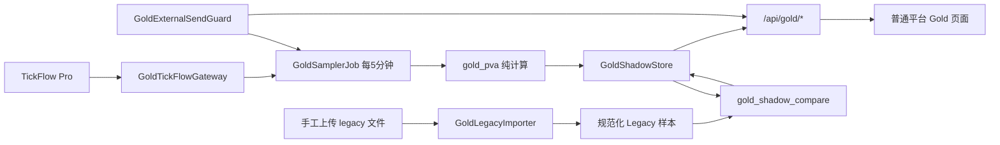

# TickFlow 中金黄金内置研究页整合设计

## 1. 文档状态

- 状态：已批准
- 日期：2026-07-19（Asia/Shanghai）
- 目标平台：`tickflow-stock-panel`
- 迁移来源：`feat/tickflow-gold-migration`，提交 `481fec626221e6a6f0822ae49004e21dd53d43a7`
- 目标基线：包含 PR #133 的干净平台基线；当前设计分支基于 `431550859f833c2dc84440125d3dc5e20a756e0a`
- 整合方式：选择性迁移，不合并或覆盖完整 Gold 源码包

## 2. 已确认决策

1. Gold 功能作为普通平台内置页面运行，不再使用独立 Gold Shell。
2. 第一版固定支持中金黄金 `600489.SH`，不抽象为通用个股策略框架。
3. 行情与日线计算数据固定来自 TickFlow Pro，不跟随平台其他数据源切换。
4. 交易日盘中每 5 分钟自动采样一次。
5. Legacy 对账输入由用户手工上传，不挂载或读取旧系统目录。
6. 第一版服务端强制零外发，只展示并持久化候选信号。
7. 沿用 10 个完整交易日观察门槛。通过门槛仅表示可以评审通知能力，不自动启用通知。
8. 不迁移 Gold 专属 macOS App、SSH 隧道、独立 Compose 或 systemd 任务。

## 3. 目标与非目标

### 3.1 目标

- 在现有认证、导航和部署体系中提供中金黄金研究页。
- 以确定性的 TickFlow Pro 数据计算 P/V/A、SJM 状态和候选信号。
- 持久化 5 分钟影子快照、健康状态、候选信号和对账证据。
- 支持安全手工导入 legacy 日志或标准 JSON，并生成机器可读对账结果。
- 在不影响平台其他功能的前提下完成 10 个完整交易日观察。
- 保留后续通知适配接口，但第一版不存在可启用的 Gold 外发配置。

### 3.2 非目标

- 不接券商、不下单、不维护生产持仓、不生成明确买卖建议。
- 不迁移 Telegram、飞书、Webhook、企业微信或其他通知所有权。
- 不把 Gold 模块推广为多标的、黄金股组合或通用策略框架。
- 不使用 stock-sdk、Tushare 或免费数据补齐 Gold 正式样本。
- 不接入 OpenClaw、金融日报或其他主链路。
- 不迁移源码包中的无关回测、策略、OCR、语音和桌面壳改动。
- 不自动判断或执行 Stage B；观察通过后仍需单独设计和人工批准。

## 4. 整合原则

### 4.1 选择性迁移

Gold 源码包是完整派生仓，而不是插件。实现时只迁移 Gold 领域文件，并在当前平台共享文件中做最小接线。不得复制整个 `backend/`、`frontend/`、`Dockerfile` 或 lockfile 覆盖目标基线。

### 4.2 普通平台模式

不迁移源分支用于缩减整套应用能力的 `gold_shadow_mode`。Gold 页面与 Dashboard、Watchlist 等页面共用普通认证和 `Layout`，其后台任务只增加一个固定单标的采样器，不关闭或重写平台其他路由、调度器和通知功能。

### 4.3 Gold 域零外发

平台其他模块可以继续使用现有通知功能，但 Gold 域不能把候选信号交给通用告警或通知流水线。Gold 外发保护按领域生效，而不是依赖全局运行模式。

## 5. 总体架构



## 6. 后端设计

### 6.1 GoldTickFlowGateway

新增窄接口封装 TickFlow Pro 调用：

- `get_quote("600489.SH")`：只接受单一固定标的。
- `get_completed_daily_closes("600489.SH", count=60)`：返回按真实交易日排序、去重且已完成的日线收盘价。
- 使用平台现有 TickFlow Key 读取机制，不新增或复制密钥文件。
- 使用平台现有 TickFlow 客户端和进程内限频器，不直接绕过限频调用 SDK。
- 任何认证、网络、限频、字段或日期错误均显式失败，不切换其他数据源。

Gold 计算不读取平台共享日线缓存。Gateway 在每个预期交易日首次运行前直接通过 TickFlow Pro 刷新 Gold 专用 `daily_history.json`，缓存记录 `source: tickflow`、交易日期、收盘价、抓取时间和内容摘要；盘中只读取该专用缓存。缓存缺失、来源不符、日期重复或已完成收盘价不足 60 条时失败关闭。

### 6.2 GoldSamplerJob

采样器独立于通用 `QuoteService`，避免给平台行情循环增加 Gold 专属分支。

- 固定周期：300 秒，不在第一版提供 UI 修改入口。
- 固定标的：`600489.SH`。
- 运行窗口：北京时间交易日 `09:30-11:30`、`13:00-15:00`。
- 周末、已知休市日或交易日历不可用时不计算候选信号。
- 交易日判断读取 `data/user_data/gold_shadow/holidays.json`；该文件缺失、损坏或未覆盖当前年份时失败关闭并显示健康错误。
- 启动时确保至少存在 60 个已完成交易日收盘价；不足时先通过 TickFlow Pro 拉取。
- 行情时间戳必须属于预期交易日、处于交易时段且不早于当前时间 10 分钟以上。
- 任务异常只更新 Gold 健康状态，不阻断平台其他任务。
- 快照以 `(symbol, quote_source, quote_ts)` 幂等提交，重复调度不得重复生成候选事件。

第一版配置只增加 `GOLD_WORKSPACE_ENABLED`，默认 `false`。Gold 状态 API 和前端路由始终注册，以便返回明确的禁用状态；只有开关启用后才显示菜单、初始化 Gold 服务并注册采样任务。不得增加 `GOLD_EXTERNAL_SEND_ENABLED` 一类可绕过零外发边界的配置。

### 6.3 P/V/A 与 SJM 计算

选择性迁移 `gold_pva.py`，保持源码包的对账兼容语义：

- `legacy_reference_60` 为最近 60 个已完成交易日收盘价的算术平均值。
- `P = (current_price / legacy_reference_60 - 1) * 100`。
- `V = current_price - previous_close`。
- `legacy_history_velocity = completed_closes[-2] - completed_closes[-3]`。
- `A = V - legacy_history_velocity`。
- `P <= -5` 为“恐慌”，`P >= 8` 为“贪婪”，其余为“死机”。
- 候选信号保留“恐慌极端”“惯性衰竭”“均值回归”“贪婪态”。

`native_ema60` 只作为研究字段展示，不参与状态和候选信号判断。第一版不得顺便修正 legacy 索引或策略阈值，否则会破坏对账基线。

### 6.4 快照合同

快照继续使用 `schema_version: 1`，必须包含：

```json
{
  "schema_version": 1,
  "observed_at": "ISO-8601 Asia/Shanghai timestamp",
  "market_date": "YYYY-MM-DD",
  "symbol": "600489.SH",
  "quote_source": "tickflow",
  "quote_ts": 0,
  "price": 0.0,
  "previous_close": 0.0,
  "legacy_reference_60": 0.0,
  "native_ema60": 0.0,
  "P": 0.0,
  "V": 0.0,
  "A": 0.0,
  "state": "恐慌|死机|贪婪",
  "candidate_signals": [],
  "new_candidate_signals": []
}
```

所有数值必须为有限值；价格、昨收和参考值必须大于零；`quote_source` 必须严格等于 `tickflow`。不符合合同的数据不得写入正式快照。

### 6.5 存储布局

保留独立于平台通用告警的 JSONL 存储：

```text
data/user_data/gold_shadow/
  snapshots.jsonl
  candidates.jsonl
  candidate_state.json
  health.json
  daily_history.json
  holidays.json
  external_send_attempts.jsonl
  imports/
    <sha256>.jsonl
  import_index.jsonl
  comparison_runs/
    <run_id>.jsonl
  comparison_index.jsonl
  observation_reviews.jsonl
```

- 文件和目录权限分别不宽于 `0600`、`0700`。
- JSONL 追加后执行 `fsync`；索引和状态文件采用临时文件加原子替换。
- 候选信号按 `(signal, symbol, market_date)` 去重并可在重启后恢复。
- 损坏行读取时告警并跳过；关键状态损坏时失败关闭，不自动重置为“已通过”。
- 快照保留策略沿用来源实现，默认保留最近 30 个自然日；对账索引和观察结论不随快照清理自动删除。

### 6.6 手工导入 Legacy 数据

新增 `GoldLegacyImporter`，不允许用户提交服务器文件路径。

- 接口仅接受 multipart 文件上传。
- 支持 UTF-8 文本日志、JSON 或 JSONL；不接受 ZIP、目录、符号链接或可执行内容。
- 单文件上限 10 MiB，超限在解析前拒绝。
- 文本日志沿用现有 legacy 解析器，仅提取时间、price、P、V、A、state 和候选信号。
- JSON/JSONL 必须通过同等字段和时间戳验证。
- 原始上传内容不长期保存。成功解析后只保存规范化样本、SHA-256、原始文件名的安全 basename、导入时间和样本数。
- 同一 SHA-256 重复导入返回已有 `import_id`，不重复写入。
- 解析失败不写入部分结果；API 错误不得回显原始日志行或潜在敏感内容。

规范化 legacy 样本固定为：

```json
{
  "schema_version": 1,
  "observed_at": "ISO-8601 Asia/Shanghai timestamp",
  "price": 0.0,
  "P": 0.0,
  "V": 0.0,
  "A": 0.0,
  "state": "恐慌|死机|贪婪",
  "signals": []
}
```

### 6.7 对账服务

迁移 `gold_shadow_compare.py` 的确定性匹配算法：

- 时间匹配窗口：150 秒。
- 价格绝对误差：不超过 `0.01` 元。
- P 误差：不超过 `0.10` 个百分点。
- V、A 误差：各不超过 `0.02` 元。
- SJM 状态和候选信号集合一致率：`100%`。
- 行情可用率：不低于 `99%`。
- 每次对账指定一个 `import_id` 和一个 `market_date`，只比较该日期数据。
- `run_id` 由规范化 legacy 输入摘要、Shadow 输入摘要、比较器版本和目标日期确定。
- 同一输入重复运行返回同一结果；输入变化生成新 run，并通过 `supersedes_run_id` 形成审计链。
- 结果先完整写入临时文件，成功后原子提交；失败不留下半个 run。

### 6.8 Gold 外发保护

定义 `GoldNotificationPort` 作为未来扩展接口，但第一版只注册 `DisabledGoldNotifier`。

- 任意 Gold 外发调用都记录渠道和时间到 `external_send_attempts.jsonl`，随后拒绝发送。
- Gold 候选信号不进入平台通用 `AlertEvent`、Webhook 或通知适配器。
- `external_send_count` 必须显示在 Gold 状态和观察门槛中。
- 外发尝试计数大于零时，10 日门槛立即失败。
- 第一版不存在通过环境变量、设置页或隐藏 API 开启 Gold 外发的方法。

### 6.9 API

所有 Gold API 复用平台现有认证：

| 方法 | 路径 | 用途 |
|---|---|---|
| GET | `/api/gold/status` | 当前状态、最新快照、健康和零外发计数 |
| GET | `/api/gold/health` | Gold 任务健康 |
| GET | `/api/gold/snapshots` | 最近快照 |
| GET | `/api/gold/candidates` | 候选信号记录 |
| POST | `/api/gold/imports/legacy` | 手工上传并规范化 legacy 数据 |
| GET | `/api/gold/imports` | 导入批次列表，不返回原始内容 |
| POST | `/api/gold/comparisons` | 对指定导入批次和日期执行对账 |
| GET | `/api/gold/comparisons` | 对账运行列表与摘要 |
| GET | `/api/gold/comparisons/{run_id}` | 指定运行的逐样本结果 |
| GET | `/api/gold/observation-gate` | 10 日门槛状态和未通过原因 |
| POST | `/api/gold/observation-reviews` | 记录人工完整交易日复核结论 |

写接口使用现有平台的认证和请求保护约定。列表接口限制分页或 `limit <= 1000`，避免一次读取全部历史。

## 7. 10 个完整交易日门槛

一个日期只有同时满足以下条件，才记为完整观察日：

1. 自动对账的 availability 不低于 `99%`。
2. 匹配样本的 price、P、V、A 容差检查全部通过。
3. SJM 状态和候选信号集合一致率均为 `100%`。
4. 行情来源全部为 TickFlow，且没有陈旧行情、跨日行情或交易时段外样本参与计算。
5. 当日 canonical 对账 run 完整且没有未解决的 supersede 链。
6. 人工确认 legacy 和 Shadow 覆盖完整交易窗口；人工确认不能覆盖自动指标失败。
7. Gold 外发尝试累计计数为 `0`。

门槛需要 10 个不同的完整交易日。另需人工确认至少一次平台或 Gold 任务重启后，快照、候选去重、导入索引和对账结果均恢复正常。

门槛输出只能是：

- `collecting`：有效日期不足 10 天。
- `failed`：存在指标失败、外发尝试或恢复验证失败。
- `review_eligible`：10 天及恢复验证全部通过，可以开始通知能力的独立设计评审。

不得输出或持久化 `notifications_enabled=true`，也不得由门槛状态自动改变运行配置。

## 8. 前端设计

### 8.1 路由与导航

- 在普通 `Layout` 增加“中金黄金”菜单，路由固定为 `/gold`。
- 页面使用平台现有认证，不使用 `GoldShadowLayout` 或 Gold 专属登录跳转。
- `GOLD_WORKSPACE_ENABLED=false` 时隐藏菜单，直接访问返回明确的功能未启用状态。

### 8.2 页面信息结构

1. 最新快照：价格、数据时间、来源、P/V/A、SJM、60 日参考值和原生 EMA60。
2. 候选信号：只显示研究标签、首次出现时间和当日去重状态。
3. 运行健康：最近成功、连续失败、最后错误、TickFlow 数据新鲜度。
4. Legacy 导入：文件选择、校验结果、导入批次和样本数。
5. 对账结果：availability、各字段通过率、缺失样本和逐样本差异。
6. 观察门槛：有效日期、未通过原因、人工复核状态和零外发计数。

页面必须明确显示“仅供研究，不构成投资建议”和“Gold 外部通知已关闭”。不得出现买入、卖出、仓位、止损或自动执行控件。

## 9. 共享文件最小接线

预计只在以下共享文件中做局部修改：

- `backend/app/main.py`：始终注册 Gold 路由；功能启用时创建 Gold 服务、注册采样任务并在退出时关闭。
- `backend/app/config.py`：增加 `GOLD_WORKSPACE_ENABLED`。
- `frontend/src/router.tsx`：增加普通 `/gold` 懒加载路由和 `Suspense` 边界。
- `frontend/src/components/Layout.tsx`：增加受功能开关控制的菜单项。
- `frontend/src/lib/api.ts`：增加 Gold 类型和 API 客户端。
- 平台设置或能力 API：只暴露是否启用，不暴露 Gold 外发开关。

不得从来源分支覆盖这些共享文件。每一处接线都应基于目标基线手工实现并单独测试。

## 10. 来源文件处置

### 10.1 迁移并适配

- `backend/app/services/gold_pva.py`
- `backend/app/services/gold_shadow.py`
- `backend/app/services/gold_shadow_store.py`
- `backend/app/services/gold_shadow_compare.py`
- `backend/app/api/gold.py`
- 对应 `backend/tests/test_gold_*.py` 和脱敏 Gold fixtures
- `frontend/src/pages/GoldWorkspace.tsx`
- `frontend/scripts/test-gold-shadow-routing.mjs` 中可复用的路由断言

### 10.2 重新设计而非原样迁移

- `external_send_guard.py`：改为始终针对 Gold 域 fail-closed，不依赖全局 Shadow 模式。
- QuoteService 接线：改为独立 `GoldSamplerJob`。
- Gold API：增加安全导入、执行对账和观察门槛接口。
- GoldWorkspace：移除独立壳假设，接入普通布局和上传流程。

### 10.3 第一版排除

- `packaging/gold_shadow_macos_app/`
- `deploy/gold-shadow/`
- `frontend/src/components/GoldShadowLayout.tsx`
- `frontend/src/lib/goldShadowRouting.ts`
- 源分支中所有非 Gold 功能和共享文件的整仓版本

## 11. 错误处理与可观测性

- 错误码至少区分：缺少 Key、TickFlow 认证失败、限频、网络失败、历史不足、行情陈旧、日期错误、时段错误、存储失败、导入格式错误和对账输入缺失。
- 日志不得包含 TickFlow Key、上传原文、平台密码或通知凭据。
- Gold 失败不影响平台其他 API、行情、策略或回测任务。
- `/api/gold/health` 返回最近成功时间、最近交易日、连续失败数、最后结构化错误和下一次计划运行时间。
- 观察门槛页面必须显示数据缺口，不能把无样本解释为通过。

## 12. 测试与验收

### 12.1 后端

- P/V/A、SJM 和四类候选信号的固定样本测试。
- 60 日历史、时间戳、交易日、时段和数据新鲜度测试。
- TickFlow 固定来源测试，验证不会调用 stock-sdk/Tushare fallback。
- 5 分钟调度和幂等提交测试，使用假时钟与假客户端，不请求真实 API。
- JSONL 原子写、损坏恢复、去重和并发测试。
- 上传大小、类型、路径、重复摘要、敏感错误回显和部分写入测试。
- 150 秒匹配窗口、全部数值容差、缺失样本和 supersede 测试。
- Gold 外发尝试必须被记录并拒绝；平台其他模块的通知行为不受影响。
- Gold API 与普通平台 API 同时注册的回归测试。

### 12.2 前端

- 普通认证后可访问 `/gold`，刷新不进入独立 Shadow Shell。
- 功能关闭时菜单和直接路由行为正确。
- 导入、对账、错误、无数据和加载状态完整。
- 长错误文本和移动端布局不重叠。
- TypeScript 构建和 Gold 路由回归脚本通过。

### 12.3 项目级门禁

- 后端完整测试通过。
- 前端生产构建通过。
- Docker 构建和健康检查通过。
- 启用 Gold 后，平台原有 Dashboard、Watchlist、Screener、Backtest、Monitor 和 Stock Analysis 冒烟通过。
- 运行日志和持久化目录敏感词扫描不包含真实 Key、Token 或密码。

## 13. 发布与回滚

### 13.1 发布

1. 在独立 feature branch 中按领域模块分批迁移。
2. 默认保持 `GOLD_WORKSPACE_ENABLED=false`，先完成自动化测试和 Docker 冒烟。
3. 在旁路部署中启用 Gold，确认只请求 `600489.SH` 且零外发。
4. 从启用后的首个完整交易日开始累计 10 日观察证据。
5. 通过后只标记 `review_eligible`，通知功能另开规格和审批。

### 13.2 回滚

- 立即将 `GOLD_WORKSPACE_ENABLED=false` 并重启平台，即可停止采样和隐藏页面。
- 回滚不删除 `data/user_data/gold_shadow/`，以便审计和重新启用。
- Gold 数据与平台其他业务数据分离，关闭 Gold 不应修改自选股、策略、回测或通知状态。
- 不执行 `down -v`，不删除或修改 legacy 系统数据。

## 14. 风险与约束

- 10 个完整交易日要求平台在全部盘中窗口持续在线；偶尔启动的本地 Mac 无法满足该门槛，应部署在持续在线的旁路服务器。
- PR #133 的限频是进程内保护，不代表跨容器或跨产品共享账户限频。Gold 与其他 TickFlow 任务应错峰并纳入同一进程预算。
- 来源分支与当前上游已经分叉，任何共享文件都必须人工移植，不能依赖整分支 merge 自动解决语义冲突。
- 源仓 `LICENSE` 为 MIT，但 README 同时写有商业使用限制。内部研究使用风险较低；未来对外分发或商业化前需单独核验授权。
- P/V/A 公式刻意保留 legacy 兼容语义，不代表其具备投资有效性。

## 15. 完成定义

第一版只有在以下条件全部满足时才算完成：

1. Gold 是普通平台内置页面，不改变平台其他功能面。
2. 只处理 `600489.SH`，正式样本来源严格为 TickFlow Pro。
3. 盘中 5 分钟采样、持久化、重启恢复和健康状态可验证。
4. Legacy 手工导入不保留原始内容，且对账结果可审计。
5. Gold 外发不可配置、不可绕过，累计发送尝试为零。
6. 10 日门槛只生成 `review_eligible`，不会自动开启通知。
7. 后端、前端、Docker 和关键页面回归门禁全部通过。
8. 无券商、自动交易、Telegram、OpenClaw 或金融日报接入。
