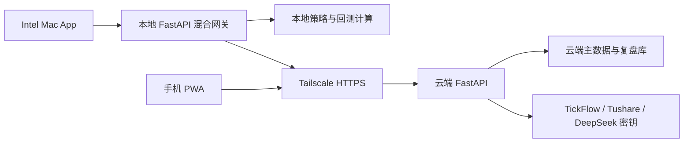

# TickFlow 多端私有 App 设计

- 日期：2026-07-20
- 状态：用户已批准
- 基线：`tickflow-stock-panel` v0.1.86 + Gold Stage A hardening
- 目标设备：Intel Mac、iPhone、Android
- 分发范围：个人私有使用

## 1. 目标

把现有 TickFlow A 股研究工作台交付为一套多端私有应用：

1. Intel Mac 本地一体化 App，保留本地策略与回测计算能力。
2. Mac 云端降级模式，在本地计算不可用时仍可继续使用云端能力。
3. 手机 PWA，通过 Tailscale 私网访问云端工作台。
4. 云端作为共享数据的唯一权威来源，Mac 与手机自动保持一致。
5. TickFlow、Tushare、DeepSeek 等 API Key 只保存在云机。

本设计服务于偶尔手动复盘和个股日线研究，不要求本地 Mac 常开。

## 2. 非目标与边界

- 不接券商账户或交易接口。
- 不做实盘、自动下单或分钟级交易系统。
- 不接入 OpenClaw 主链路。
- 不开发 Telegram 推送。
- 不使用 Tailscale Funnel，不开放公网 3018/3019。
- 不上架 App Store，不做 Apple 公证和商业分发。
- 不做离线写入、双向冲突合并或本地优先同步。
- 不自动发布正式金融日报。
- 不启用集成 Gold sampler；现有独立 Shadow 观察期不受影响。

## 3. 已确认决策

| 决策 | 结果 |
|---|---|
| 运行模型 | Intel Mac 本地一体化 + 云端轻客户端，两者均支持 |
| 手机形态 | PWA + Tailscale 私网访问 |
| 数据权威 | 云端唯一主库 |
| 离线行为 | 仅查看缓存，禁止离线写入 |
| 密钥位置 | 只存云机，客户端永不同步完整密钥 |
| Mac 分发 | 私有 Intel DMG，ad-hoc 签名 |
| App Store / 公证 | 首版不做 |
| 推荐架构 | 云端主库 + 本地计算壳，云端模式作为降级 |

## 4. 总体架构

### 4.1 云端

- 继续使用 `codex-vm` 上的 FastAPI 容器。
- 容器保持 `127.0.0.1:3019 -> container:3018`。
- Tailscale Serve 提供 tailnet 内 HTTPS 入口。
- 云端负责共享状态、数据源调用、AI 调用和云端计算降级。
- API Key 使用现有 secrets store，接口只返回配置状态和脱敏信息。

### 4.2 Intel Mac App

- 复用 `backend/app/desktop.py`、PyWebView 和 PyInstaller。
- 前端继续访问本地 `127.0.0.1`，避免直接把远端凭据交给 WebView。
- 本地 FastAPI 作为混合网关，按路由区分云端共享资源和本地计算任务。
- 本地计算引擎按需启动，关闭 App 后本地服务随进程退出。
- 本地计算失败时，网关可把支持的任务降级到云端。

### 4.3 手机 PWA

- PWA 直接访问 Tailscale Serve 的云端 HTTPS 地址。
- 不内置 API Key，不提供公网回退地址。
- 使用 Service Worker 缓存应用外壳；研究数据使用受控只读缓存。
- 首页为自选股，不增加营销页或功能介绍页。

## 5. Mac 运行模式

只发布一个 Mac App，不维护两套安装包。

### 5.1 混合模式

- 默认模式。
- 自选股、设置、复盘、共享行情缓存由云端 API 提供。
- 策略与回测优先在 Mac 执行。
- 本地计算输入来自云端，结果在线写回云端。

### 5.2 云端降级模式

- 本地计算组件启动失败或执行崩溃时自动启用。
- UI、共享数据和支持的计算任务继续通过云端完成。
- 状态栏明确显示当前处于云端模式。

### 5.3 离线只读模式

- 云端不可达时使用最近一次成功同步的缓存。
- 所有新增、编辑、删除、发布和计算提交入口禁用。
- 页面固定显示最后同步时间和“只读缓存”标识。
- 网络恢复后丢弃本地瞬时状态并刷新云端最新版本。

## 6. 混合网关边界

本地 FastAPI 增加统一 workspace adapter，业务服务不直接判断运行平台。

### 6.1 云端权威资源

- 自选股及分类
- 用户偏好和菜单设置
- 个股复盘 Markdown 与 frontmatter
- AI Review 结果
- 数据源状态和能力信息
- 行情与指标共享缓存
- 概念、行业和财务分析结果

### 6.2 本地优先计算

- 策略筛选计算
- 回测和回测结果渲染所需数据
- 指标流水线的临时计算
- 不包含密钥的数据整理和导出

### 6.3 云端强制执行

- TickFlow、Tushare、DeepSeek 请求
- 任何需要完整 API Key 的操作
- 共享状态写入
- 多端可见结果的最终持久化

## 7. 同步模型

不实现文件复制或双向同步队列。客户端通过云端 API 完成在线写入，并保存只读镜像。

### 7.1 版本控制

- 首版继续使用现有 Parquet/JSON 存储，不迁移到新数据库。
- 每类共享资源返回 `revision`、`updated_at` 和 ETag；`revision` 是规范化内容的 SHA-256，不依赖单独的版本表。
- 写入必须携带客户端最后读取的版本。
- 云端在资源锁内重新计算当前 SHA-256、比较 `If-Match`，然后调用现有原子写入服务。
- 版本过期时云端返回 `412`，不覆盖新数据；业务规则冲突使用 `409`。
- 写入完成后再发送包含新 ETag 的变更事件；进程异常重启时可从实际文件内容重新生成版本。
- 客户端收到冲突后刷新最新数据，并要求用户重新确认本次操作。

### 7.2 自动刷新

- 在线时通过 SSE 接收资源变更通知。
- SSE 断开后使用有退避的增量轮询。
- App 启动、恢复前台和网络恢复时执行 bootstrap 刷新。
- bootstrap 返回用户资料、能力、资源版本和首屏所需数据。

### 7.3 本地缓存

- Mac 缓存目录：`~/Library/Application Support/TickFlowStockPanel/`。
- PWA 使用 IndexedDB 保存允许离线查看的资源。
- 不缓存完整 API Key、Webhook、认证设置或密钥接口响应。
- 缓存记录包含数据日期、抓取时间、云端 revision 和 schema version。
- schema 不兼容或校验失败时删除该资源缓存并重新拉取。

## 8. 认证与安全

### 8.1 网络边界

- 云端应用不绑定公网地址。
- 只使用 Tailscale Serve，不使用 Funnel。
- 手机和 Mac 必须先加入同一 tailnet。

### 8.2 应用认证

- 保留应用登录作为第二层保护。
- PWA 使用 `Secure`、`HttpOnly`、`SameSite` Cookie。
- Mac 的长期会话材料存入 macOS Keychain。
- 客户端日志不得输出 Cookie、授权头或完整密钥。

### 8.3 密钥边界

- TickFlow、Tushare、DeepSeek 等 API Key 只存云端 secrets store。
- 客户端只接收 `configured: true/false` 和必要的脱敏尾号。
- 导出、诊断包和错误报告必须经过密钥扫描。

### 8.4 既有系统边界

- `GOLD_WORKSPACE_ENABLED=false` 保持不变。
- Gold API 继续要求 `external_send_count=0`。
- 不修改独立 `TickFlow_Gold_Shadow`、n8n、Telegram 或 OpenClaw。

## 9. 设备体验

### 9.1 Mac

- 保留完整桌面导航和高密度研究界面。
- 启动后进入自选股。
- 顶部状态区域显示连接、运行模式、同步时间和数据日期。
- 复杂策略参数、回测配置和大表格以 Mac 为主要操作端。

### 9.2 手机

首版重点支持：

- 自选股
- 个股日线分析
- AI 个股复盘
- Markdown 查看与下载
- 概念和行业概览
- 数据状态与基础设置
- 已有策略结果和回测摘要查看

手机不承担复杂回测参数配置。底部导航使用固定尺寸，页面必须避免横向溢出、控件重叠和表格挤压。

### 9.3 研究合规提示

- 个股复盘继续包含 `trading_advice: false`。
- `data_scope: watchlist-sample` 时固定 `can_publish: false`。
- 显示 `verification_status` 和 `needs_verification`。
- 不输出明确买卖建议，不自动进入正式金融日报。

## 10. PWA 缓存策略

### 10.1 允许缓存

- 前端静态资源
- 自选股只读快照
- 个股分析和允许缓存的复盘素材快照
- 概念、行业和数据状态的最近成功结果
- 回测摘要，不含大体积明细数据

### 10.2 禁止缓存

- 密钥和设置写接口
- 登录响应和 Cookie
- Webhook 配置
- 未脱敏异常响应
- 实时监控流和可能误导为实时的数据

离线页面必须优先显示缓存时间，不能把旧数据标记为实时或最新。

## 11. Intel Mac 打包

- 使用本机 x86_64 Python 环境构建。
- 复用 `packaging/tickflow.spec` 和红色 `packaging/icon.icns`。
- 安装 `desktop` extra、PyWebView 和 PyInstaller。
- 构建前端后生成 x86_64 `.app`。
- 使用 ad-hoc `codesign`，再生成个人使用 DMG。
- 不在 GitHub ARM runner 上交叉构建 Intel 包。
- 首次启动通过 Finder 右键“打开”处理 Gatekeeper。
- 不实现自动更新，升级通过新 DMG 覆盖安装。

现有本机环境已验证具有可加载的 x86_64 Polars、PyArrow 和 DuckDB 原生库。实现阶段仍需对最终 frozen 产物执行独立 smoke test。

## 12. 云端部署

- 继续旁路部署，不替换现有主系统。
- Tailscale Serve 反向代理到 `http://127.0.0.1:3019`。
- 云端应用必须设置应用登录，不依赖仅有网络边界。
- 数据源和 AI Key 通过云端设置页录入，不写入聊天、源码、镜像或报告。
- 部署和回滚命令记录到独立 runbook。

## 13. 错误处理

| 故障 | 行为 |
|---|---|
| Tailscale 未连接 | 显示连接指引，进入离线只读模式 |
| 云端登录过期 | 停止写入，重新登录后刷新 bootstrap |
| 云端不可达 | 使用只读缓存，指数退避重试 |
| 本地计算崩溃 | 记录本地日志，支持时降级云端执行 |
| 资源版本冲突 | 拒绝覆盖，刷新后要求重新确认 |
| API 429 | 展示配额状态，遵守现有限频和熔断 |
| 缓存损坏 | 隔离损坏资源并重新下载，不上传损坏副本 |
| App 异常退出 | 下次启动清理残留锁并检查本地服务端口 |
| 云端重启 | 客户端 SSE 重连并重新执行增量同步 |

## 14. 可观测性

- Mac 日志保存在 Application Support 目录。
- 日志记录模式切换、同步 revision、计算任务 ID 和脱敏错误类型。
- 云端记录认证、同步冲突、429、任务执行和 SSE 连接状态。
- 日志不得记录完整请求头、Cookie、API Key 或复盘私密正文。
- 健康接口区分应用健康、数据源状态和本地计算能力。

## 15. 实施阶段

### Phase 1：云端 PWA

- 增加 manifest、图标和 Service Worker。
- 建立安全缓存白名单和离线只读状态。
- 完成手机导航与重点页面适配。
- 配置 Tailscale Serve 和应用登录。

### Phase 2：Intel Mac App

- 修正 macOS 数据目录。
- 增加 Intel 本地构建和 DMG 脚本。
- 验证 PyWebView、原生依赖、单实例和关闭清理。
- 接入云端地址、Keychain 会话和云端降级模式。

### Phase 3：云端主库与本地计算

- 增加 workspace adapter 和 bootstrap 契约。
- 增加 ETag/revision、冲突保护、SSE 和增量刷新。
- 路由本地计算任务并把结果在线写回云端。
- 完成缓存损坏、网络恢复和云端降级测试。

每个 Phase 独立验收和回滚，不能以未完成的后续 Phase 作为前一阶段可用性的前提。

## 16. 测试与验收

### 16.1 自动化测试

- 云端资源 revision、ETag 和写入冲突测试。
- bootstrap、SSE 断线重连和轮询降级测试。
- 离线只读状态与写入口禁用测试。
- secrets 响应、日志和缓存的泄露扫描。
- 本地计算成功、崩溃和云端降级测试。
- PWA manifest、Service Worker 和缓存白名单测试。
- 桌面单实例、端口选择、残留锁和关闭清理测试。

### 16.2 产物测试

- Intel `.app` 双击启动并显示红色图标。
- frozen 产物加载 Polars、PyArrow、DuckDB、PyWebView。
- App 关闭后无残留本地 FastAPI 进程或监听端口。
- DMG 安装、覆盖升级和缓存保留通过。

### 16.3 多端一致性

- Mac 修改自选股后手机收到一致状态。
- 手机修改自选股后 Mac 收到一致状态。
- 两端并发修改时旧 revision 不得覆盖新数据。
- 离线设备不得提交写入，恢复后以云端版本为准。

### 16.4 视觉与真机

- Playwright 覆盖桌面、iPhone 和 Android 常见视口。
- 页面不得出现不可解释的空白、重叠或横向溢出。
- 手机 Safari/Chrome 完成自选股、个股分析和复盘查看流程。
- K 线和回测摘要在触控操作下可查看，不要求手机配置复杂回测。

### 16.5 安全回归

- 公网无法访问 3018/3019。
- Tailscale 外设备无法访问 PWA。
- 客户端无完整 TickFlow、Tushare、DeepSeek Key。
- Gold 保持关闭且 `external_send_count=0`。
- Shadow、n8n、Telegram 和 OpenClaw 状态不变。

## 17. 完成定义

以下条件全部满足才可称为首版完成：

1. Intel Mac DMG 可安装并稳定启动。
2. 手机 PWA 可经 Tailscale 私网安装到主屏幕。
3. Mac 与手机共享云端自选股和复盘数据。
4. 本地计算可用，故障时可降级云端。
5. 离线只读行为明确且无待同步写入。
6. 客户端不存在完整 API Key。
7. 自动化、产物、多端、视觉和安全验收通过。
8. 不突破交易、Telegram、OpenClaw、Gold 和公网暴露边界。
