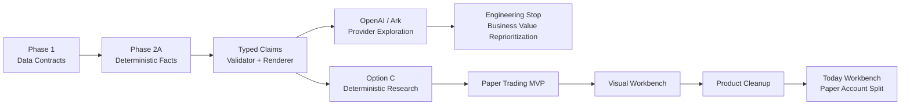
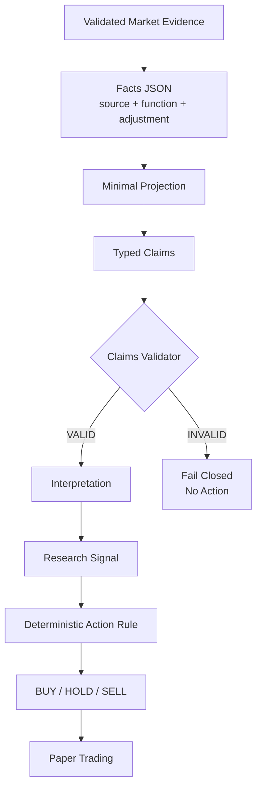
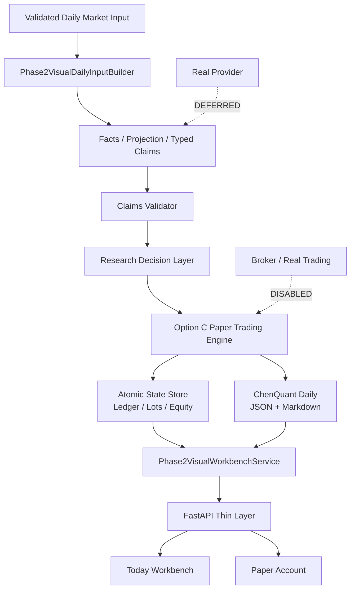
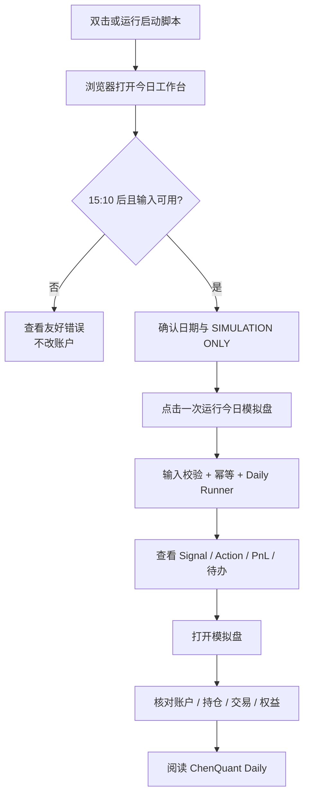

# TickFlow Stock Panel 项目结项与复盘报告

> 报告基线：Git Head `f1587ab62950583205d28652fe7e952f7dd28434`
> 证据日期：截至 2026-08-25（Asia/Shanghai）
> 产品状态：`Paper Trading=ACTIVE`、`Real Provider=DEFERRED`、`Real Trading=DISABLED`、`SIMULATION ONLY`

本报告把陈述分为三类：

- **FACT**：Git、报告、JSON、Runbook、测试或当前代码可以直接证明。
- **DECISION**：当时为推进项目做出的工程或产品选择。
- **RETROSPECTIVE**：项目完成后形成的解释，不冒充当时已经知道的事实。

## 1. Executive Context

TickFlow 最终不是“AI 自动选股平台”，而是一套单票 A 股日线研究与模拟盘工作台。它将已验证数据转成可追溯 Facts，通过结构化 Claims 和确定性规则生成 Research Signal 与 Paper Action，再以 A 股 T+1 和下一交易日开盘成交规则维护模拟账本、PnL、回撤与 ChenQuant Daily，最后通过浏览器提供日用入口。

**FACT**：当前正式范围仅包含 `000403.SZ` 派林生物；真实 Provider、券商、实盘、三票批次、云部署和自动发布均未发布。

**RETROSPECTIVE**：项目的最终价值并不来自某次模型回答，而来自一条“输入可证、决策可解释、动作可回放、状态可恢复”的工作流。

Evidence: `TICKFLOW_PAPER_TRADING_MVP_RELEASED.md`、`TICKFLOW_VISUAL_WORKBENCH_V1_RELEASED.md`。

## 2. Project Genesis

项目最初要解决三个问题：

1. A 股研究输入分散，数据口径与日期需要反复人工确认。
2. 指标和观点容易停留在描述层，缺少可验证的规则和账本。
3. 盘后研究结果难以形成稳定的日用素材和持续状态。

**DECISION**：不接券商、不做自动下单，先旁路验证数据、研究、模拟和复盘闭环。

**FACT**：2026-07-27 至 07-31 的 Phase 1.2 留下五个实际交易日的三票合同证据；2026-07-31 的合并基线后进入 Phase 2。

Evidence: `reports/tickflow_phase1_observation_final.md`、`reports/phase1_observation/observation_index.json`。
Commit: `3af4185b0342c9f274c2ba7b8cd18e6c2c8745dd`

## 3. Initial Product Thesis

初始产品假设可以概括为：

`可信市场数据 + 结构化 AI 解释 + 可发布 Markdown = 个股复盘素材源`

这个假设包含一个隐含风险：把“真实 Provider 稳定返回严格结构化内容”当成了接近确定的基础能力。项目随后花费大量工程来约束这个不确定环节。

**RETROSPECTIVE**：更稳妥的初始假设应是：数据、指标、决策和账本必须在没有 Provider 的情况下也成立；模型只补充解释，不拥有事实或动作。

## 4. Architecture Evolution



**FACT**：Provider 分支没有被删除；它被保留为历史隔离与安全资产，但已经不在当前 Critical Path。

**DECISION**：Option C 复用 Facts、Claims Validator 与 Renderer，不重新设计第二套研究架构。

## 5. Provider / Structured Output Exploration

选择真实 Provider 有合理背景：模型若能按 Strict JSON Schema 返回 Typed Claims，就可能在不自由发挥数字的前提下，提供可读解释并衔接 Markdown 复盘。

因此工程强调：

- `strict JSON Schema`：禁止自由文本、未知字段和交易 Claim。
- `immutable candidate`：把模型、端点、Prompt、Schema、Facts/Projection 哈希和镜像身份绑定到一次审批。
- `approval scope`：每个真实尝试只在独立 Scope 内生效，历史 Scope 不可复用。
- `one-shot`：`maximum_provider_attempts=1`、`retry_count=0`，避免不透明重试。
- `ledger`：网络 dispatch 一旦开始，attempt 永久消费；无法证明是否发送时标记 unknown。
- `receipt`：记录 DNS/TCP/TLS/request/headers/body 等阶段，提升可诊断性。
- `isolation`：Secret 临时只读注入、出站白名单、Proxy/Relay 分离、失败关闭。

**FACT**：这些机制通过了大量 Mock、专项测试和离线审批门禁；它们证明了安全治理能力，不等于证明真实 Provider 业务链已经可用。

Evidence: `reports/tickflow_phase2b_provider_relay_eval.md`、`reports/tickflow_phase2b_canary_runtime_contract_eval.md`、`reports/tickflow_phase2b_canary_observability_eval.md`。

## 6. Ark / TLS / Proxy Engineering

OpenAI 路径曾留下两类关键负面结果：一次 `ATTEMPT_CONSUMED_UNKNOWN`，以及一次精确 HTTP 401。Ark 路径进一步经历 exact model 的 Structured Output 能力门、严格 `json_schema`、60/75/90 到 180/195/210 的 timeout 合同、build provenance、receipt transport、TLS probe 与 Proxy/TLS 差分诊断。

**FACT**：Ark 实际 Canary `d57b276fe9014d35bdae5a92950ca17b` 在 Provider 连接阶段被阻断，未完成 TLS、未写请求体，Scope 被消费；另一个历史 Ark request `2f17745f...` 固定为 `FAILED_AFTER_DISPATCH / CONSUMED / WAITING_FOR_PROVIDER_RESPONSE_HEADERS`。后续本地差分工具仍不能证明真实 Proxy 路径的唯一根因。

**DECISION**：不删除失败证据、不复用 consumed Scope、不自动重试，也不通过改模型、改 Prompt 或降级 free text 来制造成功。

**RETROSPECTIVE**：这段工程形成了高质量的安全与可观测性资产，但业务验证增量越来越小。每一次不可归因的失败都会产生新 Candidate、Scope、hash 集合、mock 和审批，形成明显的治理放大效应。

Evidence: `reports/tickflow_phase2b_single_symbol_canary_eval.md`、`reports/tickflow_phase2b_http401_diagnosis.md`、`reports/phase2_provider_ark/live_canary/d57b276fe9014d35bdae5a92950ca17b-closeout.md`、`reports/tickflow_phase2b_ark_proxy_tls_differential_eval.md`。

## 7. Engineering Cost Escalation

成本升级主要不是代码行数，而是“证明一次请求安全且不可重复”所需的合同数量：Provider config、Proxy image、Relay image、runtime contract、approval candidate、approval scope、ledger namespace、stage receipts、cleanup proof、history baseline、build provenance、TLS probe 与 independent review。

**FACT**：Git 时间线显示 2026-08-02 至 08-16 连续出现 Provider/Canary/Ark/TLS/Approval 相关实现、修复和验证提交。仅这些里程碑就跨越约两周，而真正业务产物仍未获得有效 Claims。

**FACT**：仓库没有完整项目级 Codex token 总账和 wall-clock 总账。本报告不会拼接聊天中的单次运行数字，也不会虚构总成本。任何未来可验证的单任务 token 统计都必须标记 `PARTIAL OBSERVED AGENT USAGE`。

**RETROSPECTIVE**：AI Coding Agent 让复杂治理工件可以快速实现，也让“再补一个门禁就能成功”的路径更容易持续。速度并不能替代停止标准。

## 8. Engineering Stop Decision

`ENGINEERING_STOP_DECISION` 的含义不是“Provider 技术做不出来”，而是：

`BUSINESS_VALUE_REPRIORITIZATION`

当 Provider 工程的边际投入明显高于对用户日用价值的边际贡献时，项目选择冻结 Legacy Provider path，并把 Facts、Claims、规则和账本作为继续交付的基础。

**DECISION**：不再把 Provider 可用性作为 Paper Trading 和 Visual Workbench 的前置条件。

**RETROSPECTIVE**：这是改变项目结果的关键决策。如果继续围绕 Provider 增加 Scope 与 Probe，项目可能继续“更可证明地失败”，但仍没有每天可用的产品。

Evidence: `reports/tickflow_phase2b_option_c_paper_trading_eval.md` 中 `Option A=EXHAUSTED / Option C=ACTIVE / Legacy Provider path=FROZEN`。

## 9. Transition to Option C

Option C 没有推翻前期成果，而是重新排序：

1. 冻结且验证过的 Facts 继续作为事实源。
2. Projection 继续限制模型/规则可见的数据范围。
3. Typed Claims Validator 继续拒绝未知 Claim、错误 pointer、raw/qfq 混用和交易字段。
4. Research Decision Layer 将 Claims 映射为 `INTERPRETATION → SIGNAL`。
5. 确定性 Rule Engine 才能生成 `ACTION`。
6. Paper Trading 只消费受控 Action 与确定性 Market Fixture。

**FACT**：真实派林生物冻结 Fixture 重新计算得到 `MIXED_TECHNICAL_STRUCTURE → MIXED_OBSERVATION → HOLD`。系统接受 HOLD，没有修改 Fixture 或 Rule 来制造 BUY/SELL。

**RETROSPECTIVE**：Option C 的核心不是“去 AI”，而是把非确定性解释从交易与账本关键路径中隔离。

## 10. Deterministic Research Architecture



**FACT**：Facts 为每个数字记录来源文件、计算函数、价格口径和时间范围，并校验源 SHA、NaN/Infinity、raw/qfq 混用与敏感字段。

**FACT**：Typed Claims 不允许直接生成交易动作。无效 Claims 的结果是 no action，而不是自动删掉非法 Claim 后继续。

Evidence: `reports/tickflow_phase2a_facts_eval.md`、`reports/tickflow_phase2b_typed_claims_eval.md`、`backend/app/services/phase2_research_decision.py`。

## 11. Paper Trading Engine

Paper Trading 的可信度来自明确的市场与账本合同：

- **A-share T+1**：当日买入 lot 的 `sellable_from_trade_date` 不早于下一可交易日。
- **NEXT_TRADING_DAY_OPEN**：决策完成后只在下一可用交易日的 09:30 open 成交。
- **No fallback**：缺少下一日开盘时返回 `NO_EXECUTION_PRICE_AVAILABLE`，不回退 T 日 close，不猜价。
- **Lot size**：BUY 数量必须为 100 股整数手。
- **Decimal accounting**：现金、费用、成本、PnL 和权益不使用浮点近似。
- **Fees**：佣金、最低佣金和卖出费用由 `PaperTradingConfig` 固化。
- **Idempotency**：独立 `order_id` 与绑定 symbol/date/signal/action/fixture/config 的 idempotency key。
- **Position lots**：记录取得日期、数量和可卖日期，支持 partial sell 与 full exit。
- **PnL**：已实现、未实现、总权益和最大回撤由账本确定性计算。
- **Recovery**：每日状态以 staging、fsync、atomic rename、directory fsync 发布，可从完整 day snapshot 恢复。

**FACT**：MVP 的 deterministic lifecycle 验证了 2026-08-03 BUY pending、08-04 以 10.50 买入 100 股、08-05 SELL pending、08-06 以 11.00 卖出，最终已实现 PnL 39.45 元，最大回撤 25.55 元。

Evidence: `reports/phase2_option_c_mvp/release_verification.json`、`backend/app/services/phase2_paper_trading.py`、`backend/app/services/phase2_option_c_state.py`。

## 12. ChenQuant Daily

ChenQuant Daily 是账本与研究结果的确定性展示层，同时输出 JSON 和 Markdown。它包含决策、动作、账户、持仓、PnL、回撤、安全标识和人工待办，不从自由文本反向修改账本。

**FACT**：`can_publish=false`、`trading_advice=false` 和 `SIMULATION ONLY` 是固定边界；JSON 与 Markdown 在 Replay x3 中逐字节一致。

**DECISION**：Markdown 先作为本地素材，不自动写入正式 Obsidian Vault 或金融日报。

Evidence: `backend/app/services/phase2_chenquant_daily.py`、`reports/phase2_option_c/replay_validation.json`。

## 13. From CLI to Visual Workbench

Paper Trading MVP 最初通过 CLI Daily Runner 使用。已批准范围内的确定性合同和 Fixture 通过验证，但用户每天需要记住目录、命令、输入状态和输出位置；这不符合“打开就知道今天做什么”的日用预期。

**DECISION**：复用现有 FastAPI/React，只增加薄 API、聚合服务、今日输入准备器和浏览器页面，不重写引擎。

**FACT**：浏览器调用 `/api/paper-trading/dashboard` 读取持久状态，通过 `/api/paper-trading/run` 触发一次受控运行。前端不重算 PnL，也不拥有账本规则。

Evidence: `backend/app/api/paper_trading.py`、`backend/app/services/phase2_visual_workbench.py`、`frontend/src/lib/api.ts`。
Commit: `443858e47c14ab118c486c6adac80f991a1f7c81`

## 14. Product Cleanup

Visual v1 首版仍暴露历史 AI Provider、API Key 和 SaaS 语言，容易让用户误以为当前 Paper Trading 依赖真实 AI。

**DECISION**：隐藏或禁用历史 Provider/API Key 入口，明确展示 `Paper Trading Engine=ACTIVE`、`AI Provider=DEFERRED`、`Real Trading=DISABLED`；将导航收敛为研究工作台语义。

最终桌面导航：

`今日工作台 / 模拟盘 / 个股研究 / 市场 / 监控 / 数据 / 设置`

**FACT**：产品清理没有改变 Option C、Claims Validator、研究规则或行情算法；Provider calls、Secret reads 与 real trades 均为 0。

Evidence: `TICKFLOW_VISUAL_PRODUCT_CLEANUP_RELEASED.md`。
Commit: `ec6c6d1280db3411f642b16ed4cced1129a606b2`

## 15. Today Workbench vs Paper Account UX Split

页面被拆为两个明确问题：

- **今日工作台** `/paper-trading`：回答“今天我要干什么？”展示市场状态、Today Signal、Today Action、今日持仓、今日 PnL、今日待办、Claims 与 ChenQuant Daily，并拥有唯一运行按钮。
- **模拟盘** `/paper-account`：回答“我的账户现在怎么样？”展示总资产、现金、持仓、可卖数量、成本、累计收益、最大回撤、历史交易、历史决策和权益曲线，不触发运行。

**FACT**：两页共享同一 dashboard API 和同一持久状态，不存在第二套账户逻辑。

Evidence: `TICKFLOW_WORKBENCH_ACCOUNT_UX_SPLIT_RELEASED.md`、`frontend/src/pages/PaperTrading.tsx`、`frontend/src/pages/PaperAccount.tsx`。
Commit: `f1587ab62950583205d28652fe7e952f7dd28434`

## 16. Final Product Architecture



安全属性：

- UI 只做展示与受控触发，不计算交易。
- 账本由 Option C 单一实现维护。
- 输入缺失、日期不符、市场未收盘、企业行动不支持、重复运行或状态异常都 fail closed。
- 历史 Provider 不进入运行依赖。

## 17. Current User Workflow



启动命令：

```bash
cd "/Users/macbookpro/Documents/TradingView 量化/tickflow-phase2-ai-review"
./scripts/start_tickflow_visual.sh
```

浏览器入口：`http://127.0.0.1:3018/paper-trading`

**FACT**：运行状态保存在 `backend/data/user_data/phase2_option_c_paper/reference_account/`，已验证输入在同级 `inputs/`；刷新或重启只读取持久状态。

Evidence: `TICKFLOW_VISUAL_WORKBENCH_V1_RUNBOOK.md`。

## 18. Verification & Quality

| Capability | Status | Evidence |
|---|---|---|
| Deterministic Replay | PASSED | `reports/phase2_option_c_mvp/release_verification.json` |
| A 股 T+1 | PASSED | `reports/tickflow_phase2b_option_c_paper_trading_eval.md` |
| Next-day-open | PASSED | 同上 |
| Look-ahead guard | PASSED | 同上 |
| Future leakage guard | PASSED | 同上 |
| Decimal PnL | PASSED | MVP release verification |
| Idempotency | PASSED | Option C eval / state tests |
| State recovery | PASSED | MVP release verification |
| Desktop | PASSED at Visual v1 baseline | `reports/visual_workbench_v1/delivery_verification.json`（验证 Head `443858e`） |
| Mobile | PASSED at Visual v1 baseline | 同上；早于 2026-08-25 Cleanup/UX Split |
| Current Today/Account split | RELEASE MARKER + SOURCE PRESENT | `TICKFLOW_WORKBENCH_ACCOUNT_UX_SPLIT_RELEASED.md`、当前两页与 E2E contracts |
| UI E2E | 28 passed / 2 skipped at Visual v1 baseline | `reports/tickflow_visual_workbench_v1_eval.md`；不宣称为当前 Head 的重跑结果 |
| Provider calls | 0 in released Option C/Visual path | Release markers |
| Real Trading | DISABLED | Release markers / UI safety banner |
| Independent Review | NO P0/P1 findings | Option C、MVP、Visual reports |

详细测试数字与重叠边界见 `04_TICKFLOW_TECHNICAL_APPENDIX.md`。Visual v1 报告记录后端全量 `2907 passed / 58 failed`；58 项为已冻结 Ark/Gold 历史债务，不属于当前 Option C/Visual 回归，但仍必须保留为技术债，不能改写成“全量全绿”。

## 19. What Worked

1. **先验证数据再谈智能**：五日数据合同和冻结快照为后续所有判断提供了共同基线。
2. **结构化边界有效**：Facts、Projection、Typed Claims 和 Validator 会拒绝未通过来源、口径与 schema 合同的数字或 Claims，并阻止交易字段穿透。
3. **失败关闭有效**：Provider 失败没有自动重试，非法 Claims 没有被“修好后继续”，缺失开盘价不回退收盘价。
4. **接受 HOLD**：真实冻结样本未被人为改造成交易，说明系统忠于规则。
5. **薄 UI 成功**：浏览器复用引擎和持久状态，没有形成 UI 版第二账本。

## 20. What Was Over-engineered

Provider 阶段的每项控制单独看都合理，组合后却超过了当前业务验证需要：不可变镜像、完整 source binding、build provenance、Candidate/Scope 反复重批、approval-scoped ledger、receipt transport、TLS probe v2 和差分路径等，逐步把“一次解释性输出验证”变成了一个高保证网络执行平台。

**RETROSPECTIVE**：过度工程不等于代码质量差。问题在于保证等级与业务价值阶段不匹配。一个尚未证明能提升研究质量的 Provider，不应先获得接近高风险生产执行的治理复杂度。

## 21. What We Would Do Differently

`IF_WE_STARTED_AGAIN`：

`Data → Deterministic Research → Paper Trading → Visual Workbench → Real Usage → Optional Provider`

具体变化：

1. 第一周完成数据合同、Facts 与单票研究规则。
2. 第二周完成 T+1 模拟账本、PnL、Replay 和简单日用页。
3. 先连续日用，确认哪些解释真的需要模型。
4. Provider 只做 sidecar：输入固定 Projection，输出只读 Claims，不生成 Action，不阻塞 Daily。
5. 为 Provider 预先设停止条件：两次受控 Canary 不能形成有效 Claims，即冻结，不继续扩基础设施。

## 22. Current Limitations

- 单票 `000403.SZ`，三票正式批次未发布。
- 本地 Mac 浏览器运行，云部署未发布。
- 真实 Provider 延后，历史 UI 已隐藏或标记不使用。
- 券商与真实交易路径不存在。
- 企业行动遇到持仓口径变化时需人工确认。
- 新鲜日用输入依赖当前准备器和可用行情；失败时不会猜测或回填。
- 供应商待确认：`intraday_batch` 权限、30m 首桶是否包含 09:30、volume 单位、amount 单位。
- 自动 Obsidian/金融日报发布仍关闭。
- 旧 Ark/Gold 测试债务 58 项仍冻结；MVP 记录的三项 P2 中，UI/调度相关已有后续进展，但单票与输入自动化限制仍在。

## 23. Roadmap

优先级按真实业务价值排列：

1. **P0 日用观察**：连续使用单票工作台，记录输入失败、人工核验、HOLD 与交易日体验。
2. **P1 第二票扩展决策**：只有单票状态和企业行动处理稳定后，才扩 `600489.SH` 或 `300059.SZ`。
3. **P1 企业行动合同**：把当前人工 fail-closed 场景转成明确、可验证的账本调整策略。
4. **P1 素材导出**：在 `can_publish=false` 和人工审核前提下，旁路导出 Obsidian 素材。
5. **P2 Optional Provider**：仅在明确评价指标、固定成本上限和停止条件下恢复；Provider 仍不得产生 ACTION。

## 24. Final Assessment

TickFlow 已完成从研究工程验证到单票日用候选产品的转化，并进入真实日用观察。现有证据证明指定合同、Fixture、测试生命周期和 UI 路径通过，尚不能替代发布后的连续日用证据。其价值不是覆盖全市场，也不是替代人工投资判断，而是让“事实、解释、信号、模拟动作、账户和日报”处在同一条可验证链上。

项目没有证明真实 AI Provider 能稳定为该链路增值；相反，它证明了在 Provider 不可用时仍应维持业务闭环。当前最合理状态是保持 `Real Provider=DEFERRED`，以日用证据决定下一步，而不是再次从网络与审批基础设施开始。

总体判断：

- 作为单票 A 股日线研究和模拟盘：**可用，进入日用观察**。
- 作为正式交易系统：**不成立，也未发布**。
- 作为 AI 产品工程案例：**价值高**，尤其适合研究“如何把模型移出高风险关键路径”。
- 作为未来产品原型：**应围绕真实使用摩擦迭代，而不是围绕 Provider 能力扩张**。

# 一页纸最终结论

## 1. TickFlow 最终解决了什么？

它解决的不是“预测哪只股票会涨”，而是把单票 A 股日线研究做成一条已通过指定合同、Fixture 和 Replay 验证的闭环：可信数据进入 Facts，结构化 Claims 经过校验，确定性规则给出 Signal 与 Paper Action，T+1 模拟账本计算持仓、PnL 与回撤，ChenQuant Daily 和浏览器页面把结果呈现出来。刷新、重启和重复点击的安全语义已通过测试；发布后的连续日用稳定性仍需观察。异常输入会停止，不会猜数据或制造交易。

最终产品可以回答两个日用问题：今日工作台回答“今天我要干什么”，模拟盘回答“我的账户现在怎么样”。

## 2. 最贵的教训是什么？

最贵的教训是：安全且严格地调用真实 Provider，本身可以迅速演变成一个独立基础设施项目。Strict Schema、immutable candidate、approval scope、one-shot、ledger、receipt、TLS isolation 都有价值，但当它们无法更快地产出有效 Claims 时，继续加固只会扩大验证成本。

AI Coding Agent 显著降低了实现这些机制的成本，也因此降低了“继续再做一层”的心理门槛。真正需要被工程化的不只是代码，还有停止条件。`ENGINEERING_STOP_DECISION` 应被理解为 `BUSINESS_VALUE_REPRIORITIZATION`：停止让 Provider 阻塞产品，不是否定工程能力。

## 3. 真正的核心资产是什么？

核心资产不是某个模型或某次回答，而是四类可迁移能力：

1. 可追溯的 Facts/Projection，数字有来源、函数和口径。
2. Typed Claims Validator，将解释限制在机器可校验边界内。
3. A 股确定性 Paper Trading，包括 T+1、下一交易日开盘、Decimal、费用、幂等、恢复与 Replay。
4. 薄 API + Visual Workbench，让同一份状态既可由引擎维护，也可被用户每天直接使用。

这些资产不依赖 OpenAI、Ark 或券商，因此能长期保留，也能在未来接入可选 Provider 时继续充当安全边界。

## 4. 现在每天怎么用？

在项目根目录运行 `./scripts/start_tickflow_visual.sh`，打开 `http://127.0.0.1:3018/paper-trading`。收盘后确认日期、输入状态和 `SIMULATION ONLY`，只点击一次“运行今日模拟盘”。先在今日工作台看市场状态、Signal、Action、持仓、PnL、待办和 ChenQuant Daily，再到 `/paper-account` 核对总资产、现金、可卖数量、历史决策、交易与权益曲线。

如果系统提示输入未准备、市场未收盘、企业行动待核验、状态异常或任务已锁定，应保持停止，不手工编辑状态文件，不绕过门禁。

## 5. 下一步最值得做什么？

最值得做的是连续真实日用，而不是继续加 Provider 工程。用 20 至 30 个实际交易日记录三类证据：哪些输入经常缺失、哪些人工核验最耗时、哪些页面信息真正影响复盘。然后只解决反复出现的高频摩擦。

单票稳定后，优先考虑第二只股票和企业行动合同；Obsidian 仍以旁路、待核验、不可发布素材输出。真实 Provider 只有在一个明确实验中才值得恢复：它必须在固定成本和固定尝试数内，提高解释质量，同时不能改 Facts、Signal、Action 或账本。推荐长期路径保持为：

`Data → Deterministic Research → Paper Trading → Visual Workbench → Real Usage → Optional Provider`
