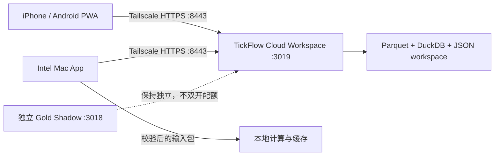

# tickflow-stock-panel 项目完成状态与 AI 验收交接报告

> 快照时间：2026-07-22 17:07:26 CST (+0800)
> 主要读者：ChatGPT、Cursor、Codex Pro、代码审查者、后续运维接手者
> 当前权威工作区：`/Users/macbookpro/Documents/TradingView 量化/tickflow-multiclient-app`
> 当前分支：`codex/tickflow-multiclient-app`
> 报告编写前 HEAD：`2ab47c18348995cebfd39f616de6abbc0955d4b8`
> 总判定：`CONDITIONAL_PASS / P0_REOPENED / NOT_PRODUCTION_READY`

本报告是产品、代码、部署、安全和后续开发的统一交接入口，不是投资分析，也不代表任何策略有效或可盈利。报告中的行情覆盖日期只用于说明系统数据状态，不构成投资建议。

## 1. 技术摘要

### 1.1 当前已经交付的部分

多端基础设施已完成自动化范围内的条件验收：

- 手机 PWA 已部署到 Tailscale 私网入口，云端只监听 loopback。
- Intel Mac `x86_64` 桌面 App、DMG、红色桌面图标和私有云连接能力已构建。
- 云端工作区同步支持 revision、ETag、SSE、并发冲突、离线只读和失败关闭。
- Desktop 端对云端路由采用允许列表；本地计算输入包有路径、大小、checksum、日期和参数 digest 校验。
- Gold 选择性迁移代码与 Stage A 安全门禁已进入当前分支，但集成页保持关闭，未向外发送信号。
- 券商、实盘、自动下单、Telegram、OpenClaw 主链路和正式金融日报自动发布均未接入。

### 1.2 当前不能宣称完成的部分

当前部署还不是可直接投入日常研究的完整产品实例：

- 应用认证仍为 `configured=false`，尚未设置真实私有密码。
- 云端数据源模式为 `none`；内置 TickFlow 可见，但当前云端没有配置 Key。
- AI Provider 为 `openai_compat`，但 `ai_configured=false`，不能在当前云端生成 AI 个股复盘。
- `stock-sdk` 插件在云端为 `available=false`；没有自定义数据源；当前权威分支没有 Tushare 插件。
- 工作区中的自选股、个股报告、市场复盘和回测摘要均为 0，尚未完成真实用户初始化。
- 真机 PWA 安装、真实 Mac App 登录、Keychain 会话恢复和 Finder/Dock 图标目视验收仍是人工门槛。

### 1.3 必须重新打开的 P0

当前权威分支存在一个已实测的增量指标缺陷：

- `backend/app/indicators/pipeline.py` 在 `run_pipeline()` 内局部定义 `_cast`，但 `_load_recent_history()` 在局部作用域之外再次引用它。
- 该函数又使用宽泛 `except Exception`，因此 `NameError` 被记录后转为空 DataFrame。
- 使用真实临时 Parquet 复现时输出 `历史数据加载失败: name '_cast' is not defined`，返回 `history_rows=0`。
- 结果是增量指标历史预热可能静默退化，进而影响均线、MACD、布林带等依赖历史窗口的确定性。

这个问题曾在历史工作区中修复并有回归测试，但没有被迁入当前多端分支。因此必须标记为 **P0 重新打开**，不能沿用“已修复”的旧结论。

### 1.4 最终决策

当前项目可继续保留为：

> **Tailscale 私网中的 A 股日线研究工作台，以及未来可接入人工复核流程的个股复盘素材源。**

但在 P0 修复、云端认证初始化、数据源配置、AI 配置和三股真实闭环完成前，只能标记为基础设施条件通过，不能标记为生产就绪、正式日报就绪或无人值守就绪。

## 2. 给接手智能体的强制说明

### 2.1 证据状态必须分开

| 状态 | 定义 | 可以如何表述 |
|---|---|---|
| 当前已核验 | 当前权威分支或当前云端在本报告快照时经过实际命令验证 | 可作为当前结论 |
| 先前最终验收 | 同一功能代码基线的既有验收证据，本轮没有重复执行破坏性或一次性门禁 | 必须注明验收时间和未重跑原因 |
| 历史已验证 | 只存在于其他 worktree、旧分支或旧样本目录 | 只能作为移植依据，不能当作当前能力 |
| 已设计未实现 | 有设计、Prompt 或 runbook，但当前代码没有完整入口 | 不得宣称交付 |
| 暂停或禁止 | 明确超出范围 | 不得擅自开发或开启 |

### 2.2 不得执行的动作

- 不向聊天、Git、日志、报告或命令历史写入任何 TickFlow、Tushare、DeepSeek、Telegram、券商或其他 Key。
- 不接券商，不接实盘，不做自动下单，不输出明确买卖建议。
- 不接 OpenClaw 主链路，不开发 Telegram，不自动发布正式金融日报。
- 不启用集成 Gold 工作区，不进入 Gold Stage B，不与现有 Gold Shadow 双开抢占 TickFlow Pro 配额。
- 不把历史脏工作区整体 merge、复制或打包覆盖到当前权威分支。
- 不在云机上直接执行 `git pull`、未审查 merge 或会重建 n8n/Postgres/Gold Shadow 的 Compose 命令。
- 不把进程内 80% RPM 预算描述为跨容器、跨产品或账户级共享限频。

### 2.3 密钥处理规则

需要真实密钥时，只允许用户在本机或云机的私有 secret store、环境文件或 Keychain 中自行写入。智能体只读取“是否已配置”、能力探测结果和脱敏错误分类。密钥如果曾进入聊天，应视为已泄露并先在平台侧轮换。

## 3. 产品范围与完成定义

### 3.1 当前目标

- A 股日线行情、自选股和技术指标的集中研究。
- Screener 与 Backtest 用于策略实验和排除明显无效思路。
- `/api/stock-analysis/analyze` 用于生成个股日线复盘候选素材。
- 未来经确定性校验和人工复核后，旁路写入 Obsidian 个股跟踪库。
- 手机 PWA 与 Intel Mac App 访问同一个私有云工作区。

### 3.2 明确非目标

- 30 分钟做 T 或分钟级交易系统。
- 自动赚钱、AI 荐股或正式投资建议。
- 实盘、券商接口、自动下单和仓位管理。
- 公开互联网服务、多租户 SaaS 或 App Store 发布。
- Telegram、OpenClaw、金融日报的自动主链路。
- 市场全局 AI 复盘的无人值守发布。

### 3.3 “完成”的正确拆分

| 层级 | 当前状态 | 说明 |
|---|---|---|
| 多端基础设施 | `CONDITIONAL_PASS` | PWA、Intel App、workspace、安全边界已自动验收 |
| 云端研究实例初始化 | `NOT_READY` | 密码、数据源、AI、自选股和真实报告均未初始化 |
| 指标正确性 | `P0_REOPENED` | 增量历史预热可静默返回空数据 |
| AI 个股复盘 | `HISTORICAL_PROTOTYPE_ONLY` | 当前 Prompt 已去交易化，但当前云端 AI 未配置，确定性校验器未合入 |
| Obsidian 自动写入 | `NOT_MERGED` | 历史工作区存在原型，当前分支没有导出脚本和固定 frontmatter 写入合同 |
| Gold Stage A | `CODE_READY_DISABLED` | 代码与测试存在，云端集成功能强制关闭 |
| Telegram / 交易 / 正式发布 | `PROHIBITED_OR_PAUSED` | 本阶段不开发、不启用 |

## 4. 源码、版本与工作区真相

### 4.1 当前权威分支

| 项目 | 值 |
|---|---|
| 本地路径 | `/Users/macbookpro/Documents/TradingView 量化/tickflow-multiclient-app` |
| 分支 | `codex/tickflow-multiclient-app` |
| 报告编写前 HEAD | `2ab47c18348995cebfd39f616de6abbc0955d4b8` |
| Fork | `dunmin1980-ux/tickflow-stock-panel` |
| Fork 分支 | `codex/tickflow-multiclient-app` |
| 功能运行镜像代码基线 | `7c4666003892c12bb284cda4f3dacab3a81de441` |
| 当前应用显示版本 | `0.1.86` |
| `backend/pyproject.toml` 版本 | `0.1.83`，存在元数据漂移 |

报告编写前本地工作区干净，Fork 分支与本地 HEAD 一致。当前多端分支尚未向上游创建 PR。

### 4.2 上游状态

本报告快照时已获取上游 Git refs：

| 项目 | 值 |
|---|---|
| 最新 tag | `v0.1.87` |
| tag peeled commit | `2c14fde788f2cbd5d9365d361c10541f368fe0ef` |
| `upstream/main` | `60fe9e6fa61dd774968d483cb8466b4b485e7ad0` |
| 当前分支相对 `v0.1.87` | 当前分支独有 117 commits，上游 tag 独有 16 commits |
| 当前分支相对 `upstream/main` | 当前分支独有 117 commits，上游 main 独有 19 commits |
| merge base | `8e4258cf20cae40002cd5449426a23753e693b1c` |

`v0.1.87` 与当前分支在至少以下 11 个文件存在并行修改：

- `backend/app/api/screener.py`
- `backend/app/api/settings.py`
- `frontend/package.json`
- `frontend/src/components/Layout.tsx`
- `frontend/src/lib/api.ts`
- `frontend/src/lib/queryKeys.ts`
- `frontend/src/pages/Data.tsx`
- `frontend/src/pages/Screener.tsx`
- `frontend/src/pages/StockAnalysis.tsx`
- `frontend/src/pages/settings/DataSourceEditor.tsx`
- `frontend/src/pages/settings/Monitoring.tsx`

因此不能在云端直接合并上游。应在独立 clean worktree 中做三方审查、回归和重新发布。

另外，`v0.1.87` 本身仍可见 `_load_recent_history()` 的 `_cast` 越界引用，也仍缺少相关 `asyncio`/`_date` 静态修复；升级 tag 不能替代 P0 修复。

### 4.3 其他本地 worktree

| worktree | HEAD / 分支 | 用途与限制 |
|---|---|---|
| `tickflow-stock-panel-v0.1.84` | `93e22c5` / `codex/local-intel-app` | 历史 Tushare、事实校验、Obsidian 原型证据；当前为 dirty，只能选择性迁移 |
| `tickflow-pro-rate-limit-p0` | `4315508` / `cursor/tickflow-pro-rate-limit-p0` | TickFlow Pro 80% 进程内限频与 live probe |
| `tickflow-stock-panel/.worktrees/tickflow-gold-migration` | `481fec6` | 原 Gold Shadow 源码迁移参考 |
| `tickflow-gold-integrated-design` | `3a17136` | Gold 集成设计历史 |

历史 `codex/local-intel-app` worktree 有大量已修改和未跟踪文件，包括 P0 修复、Tushare、校验器、Obsidian exporter、CI 和报告。不得整体提交、整体 merge 或直接部署。

## 5. 当前架构与关键代码地图

### 5.1 技术栈

| 层 | 当前技术 |
|---|---|
| 前端 | React 18、TypeScript、Vite、TanStack Query、ECharts、Lightweight Charts、PWA |
| 后端 | FastAPI、Pydantic v2、APScheduler、SSE |
| 数据计算 | Polars |
| 查询与存储 | DuckDB、Parquet、JSON 用户数据 |
| AI | OpenAI-compatible / Codex CLI 适配器；当前云端未配置 |
| 桌面 | pywebview、PyInstaller、Intel `x86_64` App |
| 私网接入 | Tailscale Serve HTTPS |

### 5.2 运行拓扑



### 5.3 关键代码位置

| 领域 | 路径 |
|---|---|
| API 路由 | `backend/app/api/` |
| 日线指标流水线 | `backend/app/indicators/pipeline.py` |
| 策略与回测 | `backend/app/strategy/`、`backend/app/backtest/` |
| 数据源抽象 | `backend/app/data_providers/` |
| AI 个股复盘 | `backend/app/services/stock_analyzer.py` |
| 个股分析 API | `backend/app/api/stock_analysis.py` |
| 工作区 API | `backend/app/api/workspace.py` |
| 工作区合同 | `backend/app/workspace/` |
| 持久化 schema 门禁 | `backend/app/workspace/storage_validation.py` |
| Desktop 网关 | `backend/app/desktop_client/` |
| 本地计算输入 | `backend/app/services/compute_input_bundle.py` |
| 计算路由 | `backend/app/services/compute_router.py` |
| 前端工作区客户端 | `frontend/src/lib/workspace.ts` |
| 离线策略 | `frontend/src/lib/offlinePolicy.ts` |
| SSE | `frontend/src/lib/useWorkspaceEvents.ts` |
| 客户端连接页 | `frontend/src/pages/ClientConnection.tsx` |
| PWA 构建 | `frontend/vite.config.ts` |
| Intel App 构建 | `scripts/build_macos_intel.sh` |
| 多端安全门禁 | `scripts/verify_multiclient_security.sh` |

### 5.4 工作区数据合同

当前同步资源为：

- 自选股。
- 允许共享的偏好设置。
- 个股报告元数据。
- 市场复盘元数据。
- 回测摘要。

关键行为：

- 读响应携带 revision/ETag。
- 写请求缺少 `If-Match` 返回 428；旧 revision 返回 412。
- 工作区开启后，旧写接口返回 409，避免绕过 revision 合同。
- SSE 通知客户端更新；冲突后不自动重放写请求。
- 离线只读，不排队写入；报告正文不进入 PWA 持久离线缓存。
- 认证失败会清除离线授权状态。
- Desktop 代理对云端 API 使用显式允许列表并 fail closed。

## 6. 阶段交付矩阵

| 阶段 | 主要目标 | 当前结论 | 证据归属 |
|---|---|---|---|
| 初始 v0.1.84 试跑 | 页面、策略、回测、监控、Review、Settings | 历史已验证 | 旧 worktree 报告与截图 |
| 第二阶段 | AI Review、Markdown、Obsidian 方案 | 历史已验证，当前未配置 AI | 旧阶段报告 |
| 第三阶段 | 单股分析优先于市场复盘 | 产品结论仍成立 | 旧样本与当前 API 结构 |
| 第四阶段 | 去交易化 Prompt、frontmatter、Obsidian 导出 | Prompt 部分已进入当前分支；固定 frontmatter/exporter 未进入 | 当前代码 + 旧原型 |
| stock-sdk / DeepSeek | 三股日线更新与 AI 样本 | 仅历史实测；云端 stock-sdk 当前不可用 | 旧报告 |
| Tushare | 混合数据源、财务/公告/复权候选 | 仅历史分支实现和合成测试；当前分支缺失 | dirty worktree |
| TickFlow Pro | 进程内 80% 预算、三股 live probe | 当前代码含限频；历史 live probe 为 `LIVE_OK` | 当前分支 + PR #133 报告 |
| Gold Stage A | 单标的、5 分钟采样、零外发、观察门槛 | 代码与 34 项测试通过；云端集成功能关闭 | 当前分支 |
| 多端 App | PWA、Intel App、workspace、安全边界 | `CONDITIONAL_PASS` | 当前分支与云端 |
| 产品初始化 | 密码、Key、AI、自选股、三股复盘 | 未完成 | 当前云端状态 |

## 7. 当前云端运行态

### 7.1 部署信息

| 项目 | 当前值 |
|---|---|
| 云端目录 | `/home/ubuntu/tickflow-stock-panel-stage-a` |
| 云端源码 HEAD | `2ab47c18348995cebfd39f616de6abbc0955d4b8`，工作区干净 |
| 运行镜像代码基线 | `7c4666003892c12bb284cda4f3dacab3a81de441` |
| 镜像 ID | `sha256:02d556047ec97314eeb10f8ae8f7e902b59efc16d1c93387d4b5d7933f5f56a5` |
| 应用容器 | `TickFlow_Stock_Panel`，容器前缀 `aeb6c7d85f91` |
| 本地绑定 | `127.0.0.1:3019 -> 3018/tcp` |
| PWA | `https://vm-0-9-ubuntu.tail21c236.ts.net:8443/`，tailnet only |
| 既有 443 | 继续代理 `127.0.0.1:8787`，未改动 |
| 健康状态 | `status=ok`、`version=0.1.86`、`mode=none` |
| Workspace | `WORKSPACE_SYNC_ENABLED=true` |
| Gold | `GOLD_WORKSPACE_ENABLED=false` |
| Cookie | `AUTH_COOKIE_SECURE=true` |

### 7.2 认证、数据与 AI

| 检查 | 当前结果 | 解释 |
|---|---|---|
| 应用认证 | `configured=false`、`authenticated=false` | 尚未达到日常使用门槛 |
| 数据源模式 | `none` | 当前云端不能依赖已配置源刷新数据 |
| 内置源 | TickFlow | 代码可见，当前无 Key |
| stock-sdk | `available=false`，runtime=`node` | 云端没有可用 Node 插件运行时/依赖 |
| 自定义源 | 0 | 没有 Tushare 或其他 custom provider |
| AI | `openai_compat`、`ai_configured=false` | 当前不能生成 AI 复盘 |
| Workspace schema | 1 | bootstrap 可读 |
| 自选股 | 0 | 五只目标股尚未导入此云端 workspace |
| 个股报告 | 0 | 尚未生成云端三股样本 |
| 市场复盘 | 0 | 符合“不做正式全市场复盘”的边界 |
| 回测摘要 | 0 | 尚未初始化真实研究记录 |

### 7.3 当前已有市场数据

`/api/data/status` 的脱敏聚合元数据显示：

- 日线和 enriched 覆盖 5,530 个 symbol，日期范围 `2025-07-21` 至 `2026-07-21`，共 243 个交易日。
- instruments 覆盖 5,530 个 symbol，`latest_as_of=2026-07-22`。
- `minute`、`adj_factor`、`financials` 当前返回 `null`。
- 日线状态中的 `rows` 返回 0，但同时存在 symbol、日期和交易日元数据；接手者不得把这个字段单独解释为“磁盘完全无日线”，应先审计聚合口径。

现有数据可用于只读页面冒烟，但由于 `mode=none` 且 P0 尚未修复，不能直接把它当作可信的每日自动复盘输入。

### 7.4 未受影响的既有服务

| 服务 | 容器前缀 | 状态 |
|---|---|---|
| n8n | `cf45d07e6f4e` | 继续运行，未由多端 App 重建 |
| Gold Shadow | `59dcb35fa8db` | 继续运行于 `127.0.0.1:3018` |
| Postgres | `0abaa309a13a` | 继续运行，未改动 |

## 8. Intel Mac App 与 PWA 产物

### 8.1 Intel App

| 项目 | 值 |
|---|---|
| 已安装 App | `/Applications/TickFlowStockPanel.app` |
| DMG | `dist/TickFlowStockPanel-intel-x86_64.dmg` |
| DMG SHA-256 | `66b9dfae51d1d757b0c302d5e2fc1407d2499b8cf4507fb7fe95a3dfda52aa15` |
| DMG 大小 | `187042992` bytes |
| 构建/安装 App tree SHA-256 | `750f9f30de3b9663f24115dc8d4ef480b810bd2fd3b7519535fccd6c3c7c5c30` |
| 签名 | ad-hoc，非 Developer ID 公证 |
| App Store / 自动更新 | 不包含 |

本报告核验时 App 未在运行，本地 Docker Desktop 也未处于可用状态。这不影响云端 PWA，但意味着本机 Docker 不能作为即时回退入口。

### 8.2 PWA

- 自动化视口覆盖 Desktop 1440x900、iPhone 14 和 Pixel 7。
- 既有最终验收记录为 25 passed、2 skipped，Service Worker precache 69 entries。
- 自动化证明响应式布局和协议冒烟，不等同于真实 iOS/Android 安装、Safari 生命周期、系统后台恢复或触摸体验认证。
- 真机必须在相同 Tailscale tailnet 内访问。

## 9. 测试与验证证据

### 9.1 本报告任务中的新鲜验证

| 验证 | 结果 |
|---|---|
| 后端全量 pytest | 1,282 passed，11 warnings，约 66.71 秒 |
| 前端 Vitest | 97 passed |
| TypeScript `tsc -b` | 通过 |
| Playwright | 25 passed，2 skipped，约 1.4 分钟 |
| Gold Stage A | 34 passed，`STAGE_A_READY` |
| 云端正式 workspace 只读合同 | `PRODUCTION_WORKSPACE_CONTRACT_OK` |
| 云端 health/auth/端口/Serve | 只读复核通过，状态见第 7 节 |
| DMG SHA 与大小 | 与既有验收记录一致 |
| Ruff F821 | **失败，4 项** |
| 增量历史真实 Parquet 复现 | **失败，返回 0 行并吞掉 `_cast` NameError** |

测试全绿与 F821/P0 同时成立并不矛盾：当前测试套件没有覆盖真实 `_load_recent_history()` 成功读取场景，也没有把 Ruff F821 纳入当前分支 CI 门禁。

### 9.2 先前最终安全验收

以下结果来自同一功能镜像基线的 2026-07-22 最终发布验收，本报告没有重新制造一次性 canary：

- `MACOS_INTEL_APP_OK`
- `WORKSPACE_SIDECAR_CONTRACT_OK`
- `MULTICLIENT_SECURITY_OK`
- 认证、SSE、200、412、428、旧写接口 409、服务重启恢复和 Gold 零外发均通过。
- canary 未出现在 PWA、App、DMG、缓存、日志或 sidecar 输出中。
- 一次性 canary 已销毁；未来只要重新构建镜像/App，就必须创建新的随机 canary 并完整重跑，不能继承旧结论。

### 9.3 历史证据，不属于当前分支能力

- stock-sdk 曾在历史工作区把三只目标股的数据日期从 `2026-07-06` 更新至 `2026-07-10`。
- DeepSeek 三股实跑中，派林生物和中金黄金通过当时的确定性检查；东方财富把 `+12.74%` 错写成涨停，两轮后进入 quarantine。
- 历史 Tushare 插件包含日线、复权、财务、涨跌停、分钟、实时、公告和参考数据的代码与合成测试，但没有形成当前分支的干净可部署提交。
- 历史 Obsidian exporter、九段式 Prompt、固定 frontmatter 和 quarantine 流程存在于 dirty worktree，不能描述为当前云端已上线。

## 10. P0、P1、P2 问题清单

### 10.1 P0：指标历史预热静默退化

当前代码位置：

- `_cast` 定义：`backend/app/indicators/pipeline.py:1022`，只存在于 `run_pipeline()` 局部作用域。
- 错误引用：`backend/app/indicators/pipeline.py:1308`。
- 宽泛吞错：`backend/app/indicators/pipeline.py:1319` 至 `1321`。

影响：

- 增量模式可能只用新数据计算窗口指标。
- 历史不足时，均线、MACD、布林带、RSI、KDJ、量比和相关策略信号可能失真或缺失。
- 由于异常被转为空表，常规页面与全量测试可能不明显失败。

历史工作区已有可参考的最小修复：让 `scan_enriched_parquet()` 使用自身兼容逻辑、通过 `collect_schema().names()` 获取 schema，并只捕获文件/Polars IO 类异常；同时增加真实 Parquet 和“编程错误不得吞掉”两项测试。必须在当前分支重新做红绿验证，不能直接宣称旧补丁有效。

### 10.2 P0：另外 3 个未定义名称

Ruff `F821` 当前共发现 4 项，除 `_cast` 外还有：

| 文件 | 问题 | 风险 |
|---|---|---|
| `backend/app/api/kline.py:797` | `asyncio` 未定义 | 单股分钟 K 同步入口可能触发 NameError |
| `backend/app/jobs/daily_pipeline.py:105` | `_date` 未定义 | 因 future annotations 即时风险较低，但属于静态合同缺陷 |
| `backend/app/services/kline_sync.py:740` | `date` 未定义 | 因 future annotations 即时风险较低，但必须修正 |

当前分支没有 `.github/workflows/backend-quality.yml`，所以这些问题没有被 CI 阻断。

### 10.3 P0：正式使用前的运维初始化

以下不属于代码 bug，但都是启用日常研究前的硬门槛：

1. 在 Tailscale 私网内初始化应用密码。
2. 选择并私下配置一个实际数据源；当前 `mode=none`。
3. 配置低成本 AI Provider；当前 `ai_configured=false`。
4. 导入派林生物、中金黄金、贵州茅台、宁德时代、东方财富。
5. 在 P0 修复和重新发布后，再生成三只目标股的真实复盘样本。

### 10.4 P1

- 从历史 dirty worktree 选择性迁入 Tushare，不迁入无关改动。
- 迁入确定性事实校验、固定 frontmatter 和 Obsidian exporter，并重新做当前分支测试。
- 为数据集记录 `source`、`as_of`、`fetched_at`、`fallback_reason` 和校验状态。
- 审计回测的复权、T+1、费用、滑点、涨跌停不可成交、停牌、未来函数和样本外验证。
- 在独立 worktree 中吸收上游 `v0.1.87`，解决 11 个重叠文件后完整重建。
- 完成真实手机安装和真实 Mac GUI 会话验收。

### 10.5 P2

- 统一 frontend、health、Python package 的版本元数据。
- 处理 Ruff 其余静态债务和弃用警告。
- 路由级拆包 ECharts 与较大的前端 chunk。
- 只有明确需要外部分发时再做 Developer ID 公证、自动更新或 App Store。
- 只有多人协作需求真实出现后再评估多租户、数据库和任务队列。

## 11. 数据源与 AI 能力真值表

| 能力 | 当前权威分支/云端 | 历史证据 | 当前决策 |
|---|---|---|---|
| TickFlow 内置源 | 代码存在，云端 `mode=none`，未配置 Key | 三股 Pro live probe 为 `LIVE_OK` | 可作为首个云端主源，但 Key 必须私下配置 |
| TickFlow Pro 限频 | 当前代码含 0.8 进程内安全因子 | `klines.batch.1d` 与 `quotes.get` 脱敏探测通过 | 不得宣称跨容器共享 |
| stock-sdk | 云端 `available=false` | 历史三股日 K 更新成功 | 暂不作为云端依赖，除非补齐 Node runtime 和发布测试 |
| Tushare | 当前分支无插件 | 历史 dirty 分支有代码和合成测试 | 只做选择性迁移和真实权限探测 |
| 自定义 Provider | 云端 0 个 | 项目有 YAML custom provider 框架 | 非当前 P0 |
| 财务 | 云端 status 为 `null` | 历史 Tushare 方案存在 | 所有复盘必须标记待人工核验 |
| 公告/重大事项 | 当前没有可靠输入 | 历史 Tushare 方案未完成真实权限验证 | 不允许 AI 写成确定性事实 |
| DeepSeek/OpenAI-compatible | 当前云端未配置 | 历史三股请求成功，但出现事实幻觉 | 配置后仍必须经过确定性校验 |

### 11.1 TickFlow Pro live probe

历史脱敏报告位于：

`../tickflow-pro-rate-limit-p0/reports/tickflow_pro_probe/20260719_210226/`

结论为 `LIVE_OK`、`errors=0`，覆盖三只股票的 `klines.batch.1d` 与 `quotes.get`。报告没有写入 API Key。

[上游 PR #133](https://github.com/shy3130/tickflow-stock-panel/pull/133) 在本报告快照时仍为 open、mergeable、clean，head 为 `431550859f833c2dc84440125d3dc5e20a756e0a`。当前多端分支已经包含该 head 作为祖先，但上游尚未合并。

### 11.2 当前 AI Prompt 的真实状态

当前 `backend/app/services/stock_analyzer.py` 已做到：

- 角色是客观技术分析，不再是“实战交易员”。
- 明确禁止买入、卖出、加仓、减仓、仓位、止损、止盈和操作建议。
- 输出 Markdown，并要求结尾说明不构成投资建议。

但当前 Prompt 是六段结构，不是历史第四阶段要求的九段结构；消息面仍允许基于价量做带 `[推断]` 的推测。更重要的是：

- 当前 `SaveReportRequest` 只接收 symbol、name、focus、content、summary、close 和 levels。
- 保存接口不会自动注入固定的 `data_scope`、`can_publish`、`trading_advice`、`verification_status` 和 `needs_verification`。
- 存储校验器会拒绝显式的 `can_publish=true`、`trading_advice=true`，并要求显式 `watchlist-sample` 配合 `can_publish=false`；但字段缺失时并不会自动补齐完整安全 frontmatter。

因此当前分支只能宣称“Prompt 已基本去交易化、存储能拒绝部分危险状态”，不能宣称“所有报告都已固化第四阶段 frontmatter”或“Obsidian 自动导出已完成”。

## 12. 安全模型与剩余门槛

### 12.1 已实现的安全边界

- 3018 和 3019 均只监听 `127.0.0.1`。
- Tailscale Serve 的 443 和 8443 均为 tailnet only。
- 云端工作区使用 revision/ETag 防止静默覆盖。
- 离线模式只读，认证失败清理离线授权。
- 报告正文不进入长期 PWA cache。
- Desktop 代理敏感设置路由受限，未知云端路由 fail closed。
- 本地输入包经过路径、大小、checksum、日期、覆盖范围和 digest 校验。
- 持久化 JSON 有 fail-closed schema 校验，危险发布标识会被拒绝。
- Gold 集成页默认关闭，Stage A 代码保留零外发门禁。

### 12.2 仍需人工完成

1. 设置真实应用密码。当前 tailnet 私网降低了暴露面，但不能替代应用认证。
2. 在真实 iPhone/Android 安装 PWA，检查启动、断网只读、恢复网络和退出登录。
3. 在真实 Mac App 登录，检查 Keychain 会话恢复和退出后会话删除。
4. Finder/Dock 目视确认红色图标。
5. 每次新构建使用新的随机 canary 完整重跑泄露扫描。

## 13. 推荐的接力实施顺序

### 13.1 P0-A：修复代码正确性

只在当前权威分支或从它切出的 clean worktree 中实施：

1. 先加入真实 Parquet 回归测试，当前代码应失败并返回 0 行。
2. 修复 `_load_recent_history()` 的 cast 作用域与异常边界。
3. 加入“编程错误不得被吞掉”的故障注入测试。
4. 修复 `asyncio`、`_date`、`date` 三项 F821。
5. 增加最小 CI 门禁：compileall、Ruff F821、完整 pytest。
6. 运行后端全量、前端单测、TypeScript、Playwright 和 Gold 回归。

验收标准：

- 真实历史 Parquet 返回 1 行而不是空表。
- 故意注入的 `NameError` 会向上抛出，不被转换为空数据。
- `ruff check backend/app --select F821` 返回 0。
- 全量测试无新增失败。

### 13.2 P0-B：重新构建并发布

代码修复后，旧镜像和旧 DMG 不包含修复，必须重新构建：

1. 创建新的随机一次性 canary，不使用真实 Key。
2. 重建云端应用镜像和 Intel App/DMG。
3. 重跑 `MACOS_INTEL_APP_OK`、`WORKSPACE_SIDECAR_CONTRACT_OK`、`MULTICLIENT_SECURITY_OK`、`STAGE_A_READY`。
4. 记录新镜像 ID、DMG SHA、App tree SHA 和代码 commit。
5. 云端先创建新数据/镜像回滚点，再做网络隔离、只读正式卷合同检查。
6. 只使用 `--no-deps` 重建应用容器，不碰 n8n、Gold Shadow、Postgres 和 443。

验收标准：新镜像和新 App 均能映射到同一个已修复 commit，canary 扫描无泄露，云端功能和安全合同重新通过。

### 13.3 P0-C：初始化真实研究实例

1. 用户在私网浏览器中初始化应用密码，不通过聊天传递。
2. 私下配置 TickFlow Pro 或经批准的数据源，并只保存脱敏能力报告。
3. 私下配置现有 DeepSeek OpenAI-compatible API。
4. 导入五只自选股：派林生物、中金黄金、贵州茅台、宁德时代、东方财富。
5. 验证日线日期、收盘价、均线关系、涨跌停标签和量能单位。
6. 生成派林生物、中金黄金、东方财富三份复盘，但保持 `can_publish=false`、`verification_status=pending`。

验收标准：三只股票输入数据日期一致可追溯，AI 文本不含交易建议，任何未核验财务/公告/公司行动都有明确 pending 标识。

### 13.4 P1-A：选择性迁移事实关卡与 Obsidian

从历史 worktree 只移植以下最小单元：

- `stock_review_validation.py` 的确定性事实合同。
- Obsidian exporter 的路径、文件名、frontmatter 和 quarantine 逻辑。
- 相关测试与必要的模型字段。
- 不依赖 Tushare 的通用事实校验先单独落地。

固定 frontmatter 目标：

```yaml
---
type: stock-analysis
source_system: tickflow-stock-panel
data_scope: watchlist-sample
can_publish: false
trading_advice: false
verification_status: pending
needs_verification:
  - latest_close
  - key_levels
  - technical_indicators
  - financial_data_availability
  - material_news
  - corporate_actions
timeframe: 1d
---
```

`data_scope: watchlist-sample` 时，`can_publish` 必须硬编码为 `false`。任何事实检查失败写入 quarantine；即使自动检查通过，也不能自动进入正式金融日报。

### 13.5 P1-B：选择性迁移 Tushare

不得假设 5,000 积分等于拥有分钟、实时和公告权限。建议顺序：

1. 把 Tushare SDK 声明为明确的可选依赖，并覆盖 Dev、Docker、Intel App 构建。
2. 先迁客户端、错误分类、限频、能力缓存和脱敏探测。
3. 分数据集验证日线、复权、财务、涨跌停、参考数据、分钟、实时和公告。
4. 每种能力独立启用，不做全局“一键 Tushare”假设。
5. 对日线 volume/amount、股票代码、交易日期和复权语义做真实三股合同测试。
6. 回退时保留实际来源和原因，不静默覆盖更新的数据。

### 13.6 P1-C：吸收上游 v0.1.87

在独立 clean worktree 中：

1. 先把 P0 修复作为独立小提交。
2. 从 `v0.1.87` 或最新审定 tag 创建集成分支。
3. 按功能组重放 multiclient commits，不一次性 merge 117 个提交。
4. 人工审查 11 个重叠文件。
5. 完整运行功能、安全、PWA、App 和 Gold 门禁。
6. 生成新 PR，不直接更新云端源码目录。

## 14. 可重复验收命令

### 14.1 本地只读审计

```bash
cd "/Users/macbookpro/Documents/TradingView 量化/tickflow-multiclient-app"
git status --short --branch
git rev-parse HEAD
git rev-list --left-right --count v0.1.87...HEAD
git rev-list --left-right --count upstream/main...HEAD
```

### 14.2 代码质量与测试

```bash
cd "/Users/macbookpro/Documents/TradingView 量化/tickflow-multiclient-app"
backend/.venv/bin/ruff check backend/app --select F821
backend/.venv/bin/pytest backend/tests -q
cd frontend
pnpm test
pnpm exec tsc -b
pnpm exec playwright test
cd ..
./scripts/verify_gold_stage_a.sh
```

在 P0 修复前，Ruff F821 **预期失败 4 项**；不要把这个失败从验收报告中隐藏。

### 14.3 云端只读检查

```bash
ssh -o ProxyCommand=none codex-vm 'cd /home/ubuntu/tickflow-stock-panel-stage-a && git status --short && git rev-parse HEAD'
ssh -o ProxyCommand=none codex-vm 'curl -fsS http://127.0.0.1:3019/health'
ssh -o ProxyCommand=none codex-vm 'curl -fsS http://127.0.0.1:3019/api/auth/status'
ssh -o ProxyCommand=none codex-vm "ss -lntH | grep -E '127.0.0.1:(3018|3019)[[:space:]]'"
ssh -o ProxyCommand=none codex-vm 'sudo tailscale serve status'
```

### 14.4 发布门禁注意事项

- `scripts/verify_multiclient_security.sh` 需要一次性随机 canary。只在新构建已完成并获得发布授权后运行。
- 不要复用或伪造先前 canary；不要使用真实 API Key 充当 canary。
- `scripts/verify_macos_intel_app.sh` 会更新跟踪的验收报告，运行前先检查工作区。
- `scripts/build_macos_intel.sh` 会把 `backend/.venv` 收敛为发布依赖。之后继续开发需执行：

```bash
cd backend
uv sync --frozen --extra desktop --extra dev
```

- 本报告快照时本地 Docker 不可用；不要假设 Compose 命令能在本机立即执行。
- SSH SOCKS 代理不稳定时，只对单条命令使用 `-o ProxyCommand=none`，不要永久改写用户 SSH 配置。

## 15. 回滚与故障控制

### 15.1 当前回滚点

| 项目 | 值 |
|---|---|
| 云端备份 | `/home/ubuntu/tickflow-backups/20260722_130555-multiclient` |
| 云端回滚镜像 tag | `tickflow-stock-panel:rollback-20260722-130555` |
| 回滚镜像 ID | `sha256:cb4068946c893fcc04b0f5093c194256dafe3b8f14be34b0036f42e7bad2b194` |

### 15.2 故障顺序

1. Workspace 写入异常时，先设置 `WORKSPACE_SYNC_ENABLED=false`。
2. 只重建或停止 `app`，不得停止 n8n、Gold Shadow 或 Postgres。
3. 镜像异常时使用已记录 rollback tag。
4. 数据异常时先执行只读 storage/revision 合同，确认损坏后才按原子恢复 runbook 操作。
5. 不得在运行容器仍写入时覆盖 `user_data`。

完整恢复流程以 `docs/workspace-sync-runbook.md` 为准。

## 16. 证据索引

### 16.1 当前权威仓库

- `reports/tickflow_multiclient_app_acceptance.md`：多端 App 总验收。
- `reports/multiclient_acceptance/results.md`：多端协议、安全和发布结果。
- `reports/macos_intel_acceptance/results.md`：Intel App 结果。
- `docs/runbook.md`：总运行手册。
- `docs/workspace-sync-runbook.md`：workspace 部署和回滚。
- `docs/macos-intel-private-runbook.md`：Intel App 安装与发布。
- `docs/pwa-private-runbook.md`：PWA 私网运行。
- `reports/gold_stage_a_hardening_eval.md`：Gold Stage A 加固。
- `docs/gold-stage-a-runbook.md`：Gold Stage A 运行边界。
- `docs/tickflow-pro-shared-rate-limit.md`：进程内 RPM 预算边界。

### 16.2 历史本地证据

以下文件不在当前权威分支，仅可作为选择性迁移依据：

- `../tickflow-stock-panel-v0.1.84/reports/tickflow_project_summary_for_chatgpt.md`
- `../tickflow-stock-panel-v0.1.84/reports/tickflow_performance_quality_eval.md`
- `../tickflow-stock-panel-v0.1.84/reports/tickflow_stock_sdk_deepseek_eval.md`
- `../tickflow-stock-panel-v0.1.84/reports/tickflow_fact_validation_eval.md`
- `../tickflow-stock-panel-v0.1.84/reports/tickflow_v0.1.84_obsidian_validation.md`
- `../tickflow-pro-rate-limit-p0/reports/tickflow_pro_probe/20260719_210226/probe_summary.md`

## 17. 交给下一位智能体的验收任务

建议将以下内容连同本报告一起交给 ChatGPT、Cursor 或另一个 Codex Pro 任务：

```text
你正在接手 tickflow-stock-panel。请先阅读：
reports/tickflow_project_completion_ai_handoff.md

当前权威工作区：
/Users/macbookpro/Documents/TradingView 量化/tickflow-multiclient-app

硬边界：
- 不接券商、不接实盘、不自动下单；
- 不接 OpenClaw 主链路、不开发 Telegram；
- 不启用 Gold、不进入 Stage B、不开放公网；
- 不把 AI 文本当投资建议，不自动发布金融日报；
- 不在聊天、Git、日志中处理真实 Key；
- 不整体合并 tickflow-stock-panel-v0.1.84 dirty worktree。

先做只读审计，不修改云端。回答：
1. 报告中的当前能力、历史能力和未实现能力是否分界准确；
2. P0 _load_recent_history 缺陷是否可复现，影响面是否完整；
3. 另外 3 个 F821 的运行风险和最小修复；
4. 当前云端为何仍不是可日常使用的研究实例；
5. P0 修复、重建、认证/数据/AI 初始化的正确顺序；
6. 哪些历史 Tushare、事实校验、Obsidian 代码值得选择性迁移；
7. 吸收 v0.1.87 时哪些重叠文件需要人工合并。

输出格式：
- 总体结论；
- 事实矛盾或证据缺口；
- P0 阻断项；
- 下一步仅列 3 个任务，每个写验收标准；
- 明确列出禁止执行的动作。

不要因为 1282 个后端测试通过就忽略 Ruff F821 和真实 Parquet 复现失败。
```

## 18. 最终就绪矩阵

| 领域 | 判定 | 依据 |
|---|---|---|
| 源码可构建与大部分回归 | `PASS_WITH_DEFECT` | 大量测试通过，但 F821 和真实 P0 仍存在 |
| 云端多端基础设施 | `CONDITIONAL_PASS` | 私网、workspace、PWA、安全合同已验收 |
| 云端应用认证 | `NOT_READY` | `configured=false` |
| 云端数据刷新 | `NOT_READY` | `mode=none`，stock-sdk 不可用，无 Tushare |
| 云端 AI 复盘 | `NOT_READY` | `ai_configured=false` |
| 个股事实校验 | `HISTORICAL_ONLY` | 当前分支无 validator |
| Obsidian 导出 | `HISTORICAL_ONLY` | 当前分支无 exporter 和固定 frontmatter 写入 |
| Intel Mac App | `CONDITIONAL_PASS` | 构建、哈希和自动验收通过；真实 GUI/公证未完成 |
| 手机 PWA | `CONDITIONAL_PASS` | 模拟设备通过；真机安装未完成 |
| Gold 集成 | `DISABLED_BY_DESIGN` | Stage A 代码在，云端开关 false |
| Telegram / OpenClaw / 交易 | `PAUSED_OR_PROHIBITED` | 明确不在范围 |
| 正式金融日报自动发布 | `PROHIBITED` | 仅允许人工核验后的候选素材 |

## 19. 结论

本轮真正完成的是 **私有多端研究工作台的基础设施和安全骨架**，不是“完整可无人值守运行的量化产品”。当前最重要的下一步不是继续增加功能，而是：

1. 修复并验证指标历史预热 P0 与全部 F821。
2. 用同一修复 commit 重建云端镜像和 Intel App，重新通过安全门禁。
3. 私下完成认证、数据源、AI 和三股真实素材闭环，再决定是否迁移 Tushare 与 Obsidian 自动写入。

在这三项完成前，项目应保持 `CONDITIONAL_PASS / P0_REOPENED / NOT_PRODUCTION_READY`。Telegram、OpenClaw 主链路、Gold 启用、券商、实盘、自动交易和正式金融日报自动发布继续暂停。
